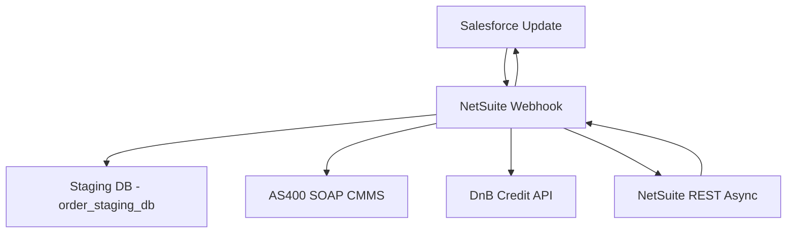
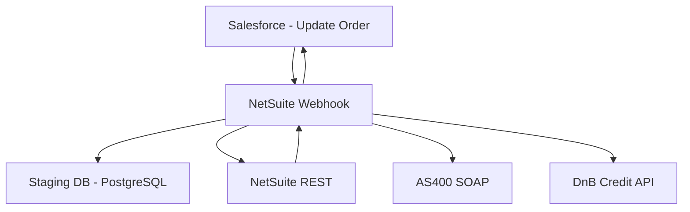
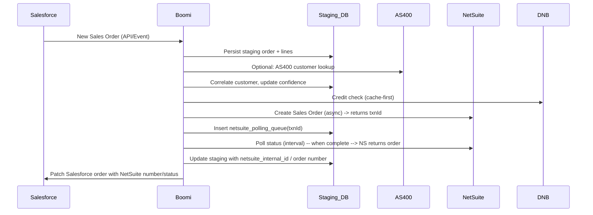
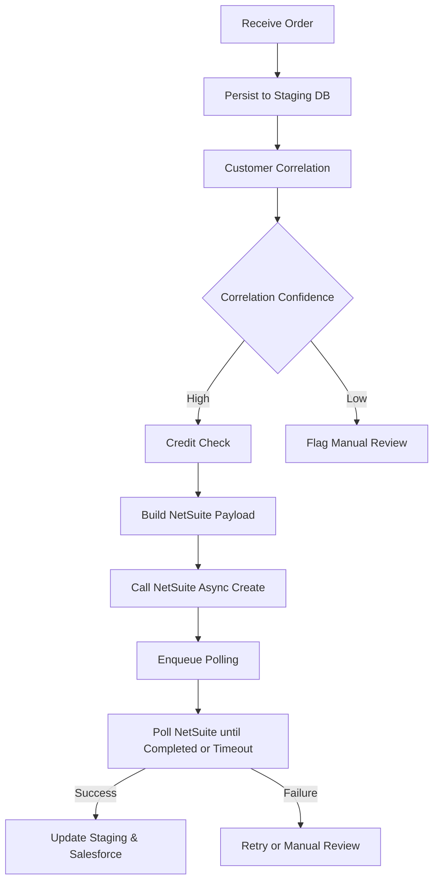
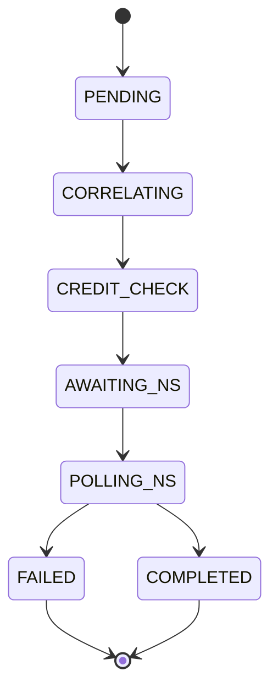
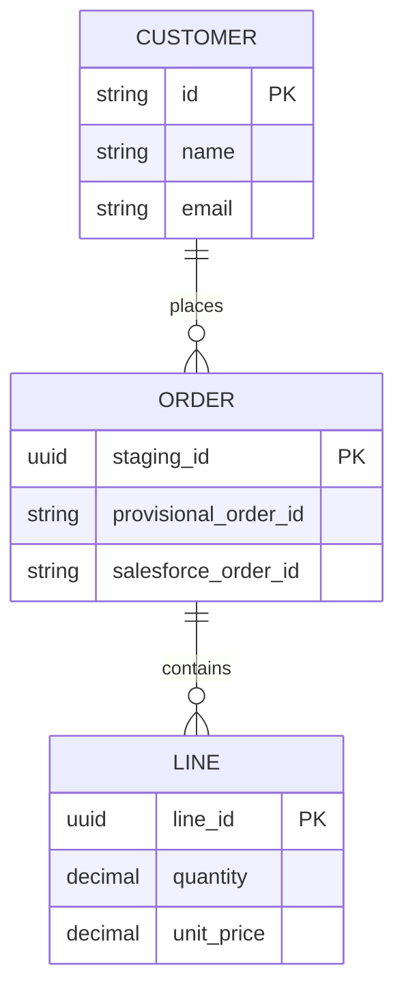
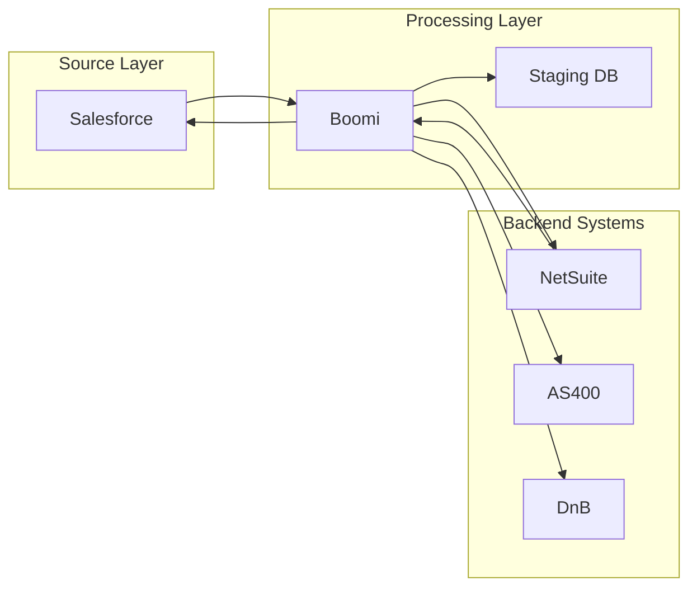

# Design Document: Salesforce to NetSuite Sales Order Integration (Boomi)

## Executive Summary
We will implement a Boomi-led, real-time integration to automate sales order flow from Salesforce to NetSuite and to synchronize status and credit information back to Salesforce. The solution uses a lightweight AWS RDS PostgreSQL staging database for correlation, provisional ID management, and retries. Phased delivery reduces risk: Phase 1 (core order flow), Phase 2 (credit & inventory/AS400), Phase 3 (advanced pricing, returns, custom products).

## Problem Statement
Current process is manual or semi-manual with multiple data gaps and shadow systems: sales orders are entered manually into NetSuite, credit data resides on an AS/400 (SOAP), product master sync has gaps, and subsidiary routing rules live in Excel. This causes delays, errors, and tax/compliance risk.

## Proposed Solution
Use Boomi AtomSphere for orchestration, a staging RDS PostgreSQL DB for durable correlation and retries, and API integrations to Salesforce (REST), NetSuite (SuiteTalk REST async), AS/400 (SOAP), and D&B (credit). Implement provisional order IDs, async polling for NetSuite, smart caching for credit checks, and a subsidiary decision service to replace the Excel matrix.

### Integration Approach
- Real-time (preferred) ingestion from Salesforce Platform Events / REST
- Immediate acknowledgement with provisional order ID
- Persist order and lines in staging DB for correlation and enrichment
- Perform customer correlation (multi-key) and credit checks (cache-aware)
- Create NetSuite sales order via async REST; add to polling queue
- Poll NetSuite for final order number; update staging and Salesforce
- Sync NetSuite status changes via webhooks back to Boomi -> Salesforce

### Key Components
- Boomi AtomSphere (orchestration, mapping, retries)
- AWS RDS PostgreSQL (order_staging_db) for correlation, polling queue, audit
- Salesforce (Sales_Order__c, Sales_Order_Line__c, Platform Events)
- NetSuite SuiteTalk REST (async salesOrder creation + webhooks)
- AS/400 SOAP CMMS (credit usages & customer master)
- Dun & Bradstreet API (credit score) with smart caching
- Monitoring/Alerting (CloudWatch/Datadog), Daily reconciliation reports

## Technical Architecture
High level flow:

### System Architecture Diagram

### Data Flow Sequence Diagram

### Process Flow Diagram

### State Transition Diagram

### Entity Relationship Diagram

### Component Interaction Diagram

## Implementation Plan
Deliver in three phases with clear cutover gating and test criteria.

### Phase Breakdown
- Phase 1 (6 weeks): Core order flow for standard products and existing correlated customers
  - Boomi flows: Receive SF order, persist staging, correlation, NS async create + poll, update SF
  - Staging DB schema deployed
  - Monitoring + retries
  - Integration tests (end-to-end)
- Phase 2 (6 weeks): Credit + Inventory + AS/400
  - AS/400 SOAP integration for credit lookups and utilization updates
  - D&B caching implementation and rate-limit handling
  - Inventory status mapping and vendor lead time lookup
- Phase 3 (6 weeks): Advanced features and cleanup
  - Custom product handling, price book sync, returns/RMA handling
  - Subsidiary decision engine migration from Excel with audit trails
  - Performance tuning and hardening

### Data Mappings
Primary mappings follow the field mapping CSV (salesforce-netsuite-field-mapping.csv). Key rules:
- Provisional_Order_ID -> custbody_provisional_id
- Sales_Order__c.Account__c -> correlation -> netsuite_customer_id
- Line.Product2Id -> netsuite_item_id via product correlation table
- Inventory status: normalize free-text to NetSuite enumerations (In Stock, Backordered, Partial, Drop Ship, Special Order)
- Totals validated after line items are added; NetSuite is source of truth for final total

### Error Handling Strategy
- Retries with exponential backoff for transient errors
- netsuite_polling_queue with max poll attempts (default 36 at 5s intervals)
- Dead-letter/manual review queue for items requiring human intervention
- Integration_errors table with full request/response for troubleshooting
- Alerts (email/pager) for repeated failures, certificate expiry, AS/400 lockouts

## Success Metrics
- Integration availability: 99.9% during business hours
- Order sync latency: provisional acknowledgment < 5s; final NetSuite confirmation < 3 minutes (typical 5-30s)
- Error rate: <0.1% with manual review workflow
- Reconciliation: daily reconciliation success > 99.9%

## Technical Specifications
- Boomi runtime: Atoms deployed in cloud region near NetSuite/Salesforce
- Staging DB: AWS RDS PostgreSQL (order_staging_db), partitioning and retention as per schema
- Security: OAuth2/JWT for Salesforce, OAuth2/TBA for NetSuite, X.509 client cert for AS/400
- Logging: Structured logs to CloudWatch / Datadog; audit_log persisted in DB

### Database Schema
Primary schema available in staging-database-schema.md. Highlights:
- staging_orders (staging_id, provisional_order_id, salesforce_order_id, netsuite_transaction_id, netsuite_order_number, correlation keys, status fields)
- staging_order_lines (line_id, staging_id, salesforce_product_id, netsuite_item_id, quantity, unit_price)
- customer_correlation_map (master mapping between SF/NS/AS400 IDs)
- credit_check_cache (cache for D&B and AS400 credit data)
- netsuite_polling_queue (txn polling management)
- integration_errors and audit_log tables for troubleshooting and compliance

### API Integrations
- Salesforce: REST v59.0 (JWT Bearer Flow recommended); use Platform Events/Streaming for real-time events
  - Endpoints: /sobjects/Sales_Order__c, composite sobjects for lines
- NetSuite: SuiteTalk REST v2 (async salesOrder create) + webhook for status changes
  - Create: POST /record/v1/salesOrder (returns transactionId), poll /transaction/v1/status/{transactionId}
  - Concurrency: 4 parallel requests per integration user; watch async queue and rate limits
- AS/400: SOAP 1.2 over HTTPS with X.509 client certificate; endpoints for getCreditInfo, updateUtilization
  - Constraints: certificate renewal every 90 days (manual portal), EBCDIC batch exports
- Dun & Bradstreet: REST credit API; enforce caching for 72-hour TTL and throttle to 100 calls/hour

### Transformation Rules
- Inventory_Status_Text__c normalization: map common free-text values to NetSuite enums; default to Unknown and flag manual review when ambiguous
- Currency and decimals: ensure European decimal handling when interacting with AS/400 (EBCDIC conversion)
- Order Numbers: use provisional ID for immediate UI feedback; replace with NetSuite order number once confirmed
- Quantity rules: query NetSuite item type before mapping; reject or round inventory-item decimal quantities per policy
- Special_Terms__c: truncate to NetSuite 4000 char limit and log truncation

## Risks and Mitigations
- AS/400 certificate renewal and legacy SOAP (Risk: Operational lockout) -> Mitigation: Automate certificate renewal where possible; maintain Windows 2012 renewal server as fallback; notify 14 days before expiry
- D&B rate limits (100 calls/hour) -> Mitigation: Implement credit_check_cache with 72-hour TTL, prioritized checks, and fallback to cached data with manual review
- Subsidiary matrix in Excel (single point-of-failure) -> Mitigation: Immediately backup Excel, then implement subsidiary decision engine in staging DB with audit trail; plan October cutover
- Data quality (generic emails, missing tax IDs) -> Mitigation: Correlation confidence scoring, manual review queue, data quality improvements in Salesforce
- NetSuite async latency & polling (order confirmation delay) -> Mitigation: Provisional ID strategy and user messaging; configurable polling window and backoff
- Product mismatches / custom products -> Mitigation: Flag custom products, block orders until manual creation or implement on-demand product creation workflow

## Timeline
- Project kickoff: Week 0
- Phase 1: Weeks 1-6 (Core order flow + staging DB + tests)
- Phase 2: Weeks 7-12 (AS/400 credit, D&B caching, inventory mapping)
- Phase 3: Weeks 13-18 (Custom products, pricing sync, subsidiary decision engine, cutover)
- Go-Live: End of Week 18 (after cutover verification)

---
*Generated from template: design-doc.md*
