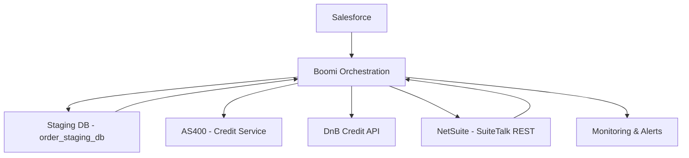
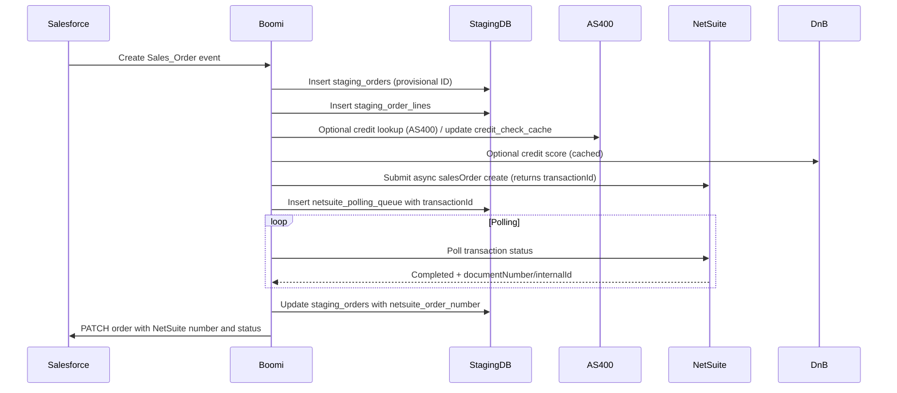
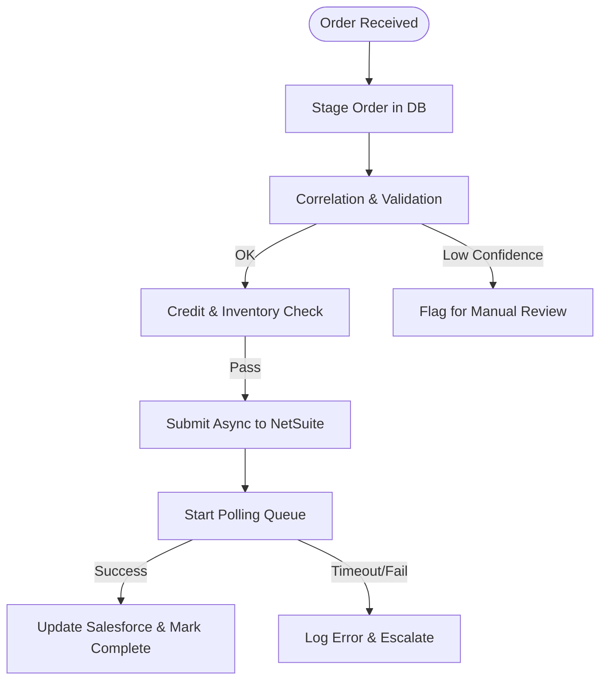
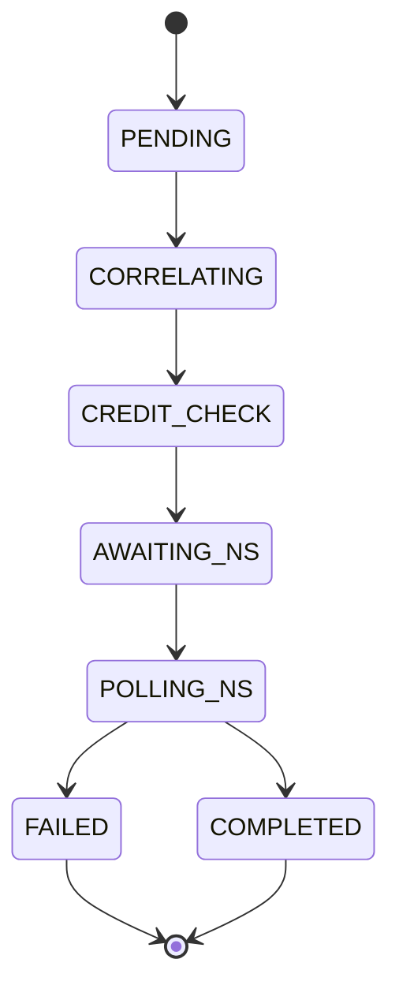
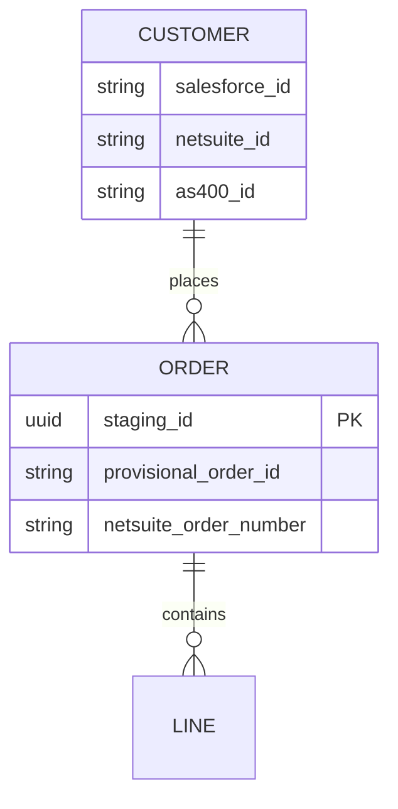
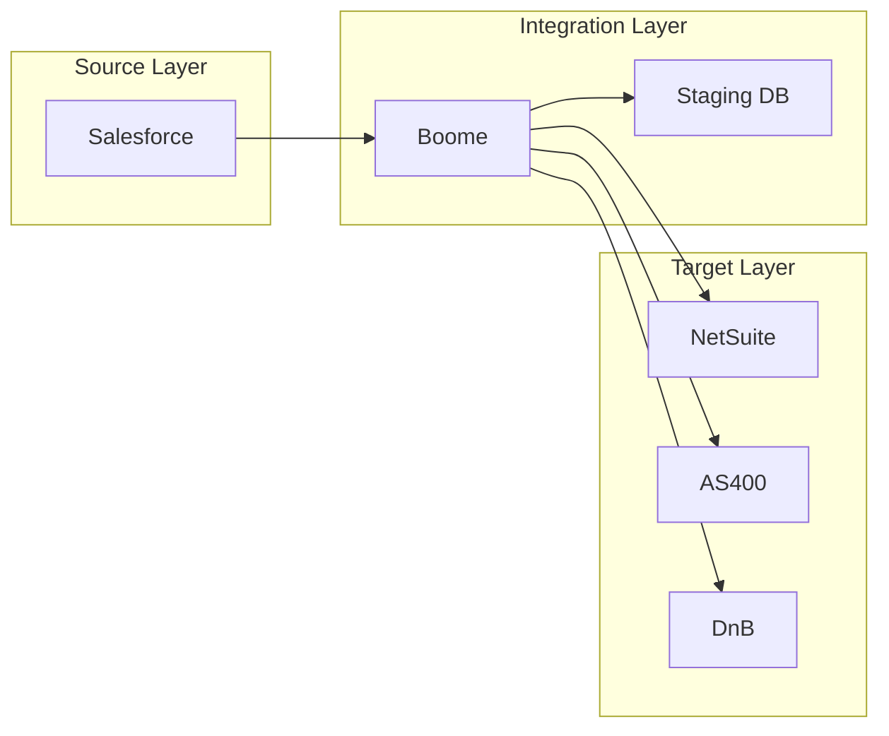

# Design Document: Salesforce to NetSuite Sales Order Integration

## Executive Summary
Deliver an automated, resilient, and auditable integration to synchronize sales orders from Salesforce to NetSuite. Use Boomi AtomSphere as the orchestration platform and an AWS RDS PostgreSQL staging database to handle correlation, provisional IDs, retries, and caching (credit checks). Phase the work to reduce risk: Phase 1 core order flow for standard products and existing customers; Phase 2 credit and inventory; Phase 3 advanced features (pricing, returns, custom products).

## Problem Statement
Current process is manual and error-prone: sales enters orders in Salesforce while finance duplicates work in NetSuite. Additional complexity comes from a legacy AS/400 credit system, inconsistent customer/product correlation keys, asynchronous NetSuite order creation, D&B rate limits, and subsidiary routing logic living in unmanaged Excel files. These cause delays, rework, and tax/compliance risk.

## Proposed Solution
- Platform: Boomi AtomSphere for orchestration (selected for balance of capability and maintainability).
- Staging: AWS RDS PostgreSQL (order_staging_db) to persist inbound orders, correlation state, credit cache, and polling queue.
- Pattern: Accept order from Salesforce, create provisional ID, stage order, perform correlation & validation, call external credit services and AS/400 as needed, submit async create to NetSuite, poll for final order number, update Salesforce.
- Phased rollout to reduce scope and surface dependencies early.

### Integration Approach
- Real-time first-touch: accept Salesforce order create events and immediately persist to staging with provisional_order_id.
- Correlation service: composite-key lookup (AS400_ID, DUNS, email, fuzzy name) using customer_correlation_map with confidence scoring.
- Credit & inventory validation: consult credit_check_cache and AS/400 APIs, use cached D&B results if within 72 hours to obey rate limits.
- NetSuite async flow: submit sales order via SuiteTalk REST (async), queue transactionId in netsuite_polling_queue, poll at 5s intervals until complete or timeout, then update both staging and Salesforce.
- Error handling: exponential retries for transient failures, escalation to manual review when thresholds exceeded, integration_errors logging and audit_log for compliance.

### Key Components
- Salesforce: source of truth for sales orders and UI-facing updates.
- Boomi: orchestration, transformations, connector to Salesforce, NetSuite, AS/400, and D&B.
- AWS RDS PostgreSQL (order_staging_db): staging_orders, staging_order_lines, customer_correlation_map, credit_check_cache, netsuite_polling_queue, integration_errors, audit_log.
- NetSuite (SuiteTalk REST v2): async salesOrder create, webhooks for status changes.
- AS/400 (CMMS SOAP): credit info and vendor lead times (client-certificate auth, legacy constraints).
- D&B (credit API): credit score, subject to rate limits (100 calls/hour) and 72-hour caching.
- Monitoring & Alerting: Boomi monitoring, CloudWatch for DB, and daily reconciliation reports.

## Technical Architecture
The architecture uses Boomi as the orchestrator with a persistent staging database to make correlation and retries reliable. External systems (AS/400, D&B, NetSuite) are called as services; NetSuite operations are handled asynchronously.

### System Architecture Diagram

### Data Flow Sequence Diagram

### Process Flow Diagram

### State Transition Diagram

### Entity Relationship Diagram

### Component Interaction Diagram

## Implementation Plan
- Phase 1 (6 weeks): Core order flow for standard products and existing customers
  - Build Boomi processes for inbound order, staging, product correlation, basic validation, async NetSuite create + polling, Salesforce update
  - Deploy staging DB schema and stored procedures (sp_get_or_create_correlation)
  - Implement monitoring, logging, and reconciliation report
- Phase 2 (6 weeks): Credit checks, AS/400 integration, inventory rules, subsidiary decision engine
  - Implement AS/400 SOAP connector with certificate management process
  - Implement credit_check_cache and D&B caching logic
  - Migrate subsidiary Excel rules into decision service in staging DB
- Phase 3 (6 weeks): Advanced features
  - Custom product creation handling, pricing sync, RMA/returns, commission recalculation trigger redesign

### Phase Breakdown
- Discovery & design (2 weeks)
- Development sprints (iterative, 2-week sprints per phase)
- System & integration testing (2 weeks per phase)
- Pilot & cutover (1-2 weeks)

### Data Mappings
Primary mapping strategy summarized (full mapping exists in salesforce-netsuite-field-mapping.csv):
- Order header: map Order_Date__c -> tranDate, use provisional_order_id as custbody_provisional_id, update External_Order_Number__c after NetSuite creation
- Customer: correlate by AS400_Customer_ID, DUNS, email, fuzzy name; store correlations in customer_correlation_map
- Line items: Product2Id -> item via NetSuite_Item_ID__c; if Custom_Product__c true then flag and block until manual creation
- Credit: AS/400 primary for credit limit, D&B for credit score (cache 72 hrs)

### Error Handling Strategy
- Persistent error logging in integration_errors table with request/response payloads
- Retry policy: exponential backoff, max_retries default 3, escalation to manual review with requires_manual_review flag
- NetSuite polling: timeout after max_poll_attempts (default 36 = ~3 minutes); if timed out, mark order FAILED and notify ops
- Monitoring: Boomi process alerts + CloudWatch alarms for DB anomalies and reconciliation mismatches

## Success Metrics
- 99.9% integration uptime
- Order sync latency: median < 30s, 95th percentile < 3min
- Reduce manual order entry to 0 for standard orders
- Reconciliation mismatches < 0.1% after 30 days

## Technical Specifications
- Boomi Atoms deployed in cloud region near NetSuite & Salesforce for latency minimization
- RDS PostgreSQL instance with read-replicas for reporting; monthly partitioning on staging_orders
- Secrets stored in AWS Secrets Manager; client certs handled on a managed Windows runner for AS/400 renewals
- IAM roles and least-privilege service accounts for Boomi and DB access

### Database Schema
Use the provided staging database schema (staging-database-schema.md) including:
- staging_orders, staging_order_lines, customer_correlation_map, credit_check_cache, netsuite_polling_queue, integration_errors, audit_log
- Views: v_orders_pending_correlation, v_orders_stuck_polling
- Stored procedure: sp_get_or_create_correlation

### API Integrations
- Salesforce: REST API v59.0 for create/patch and platform events for status changes
- NetSuite: SuiteTalk REST v2 async salesOrder create and transaction status polling; configure webhook for status-change as backup
- AS/400: SOAP client-certificate-authenticated endpoints (getCreditInfo, updateUtilization); note legacy constraints and German docs
- D&B: credit API with 100 calls/hour limit; implement caching and rate-limit tracking

### Transformation Rules
- Normalize Inventory_Status_Text__c free-text values to NetSuite shipStatus (mapping table)
- Apply contract pricing lookup before send; allow NetSuite to override and reconcile post-fact
- Date formats: use ISO 8601 in transit; convert for AS/400 EBCDIC expectations where required
- Decimal formats: ensure consistent decimal separators and precision conversions

## Risks and Mitigations
- AS/400 certificate renewal requires legacy portal and IE11 -> mitigation: automate renewal on a managed Windows host, track expiry and alert 14/7/1 days prior
- D&B rate limits -> mitigation: caching strategy (72 hours), prioritize calls, degrade to manual review when necessary
- Subsidiary Excel logic -> mitigation: migrate rules to decision engine in staging DB, implement version control and audit trail
- Product customizations -> mitigation: flag custom products and block order until NetSuite item created; provide UI for rapid item creation by ops

## Timeline
Total estimated: 16-18 weeks across three phases. Detailed timeline in implementation plan above.

---
*Generated from template: design-doc.md*
