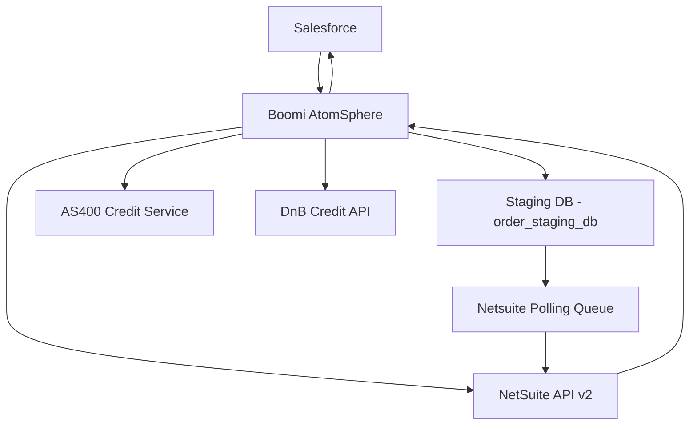
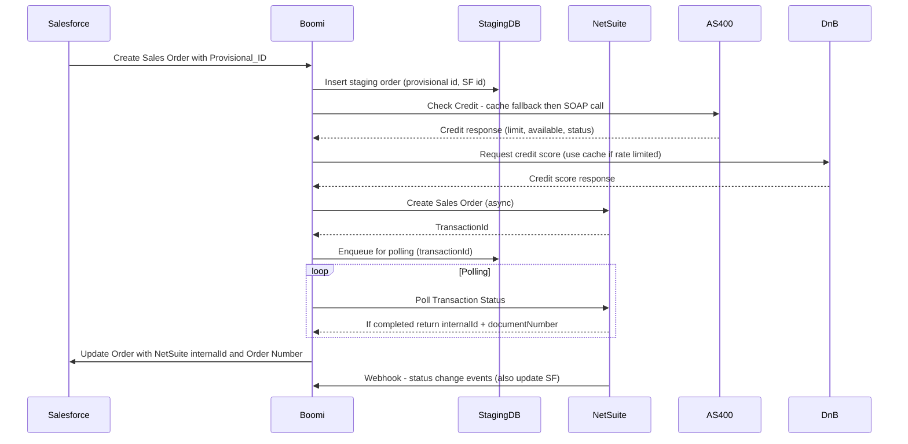
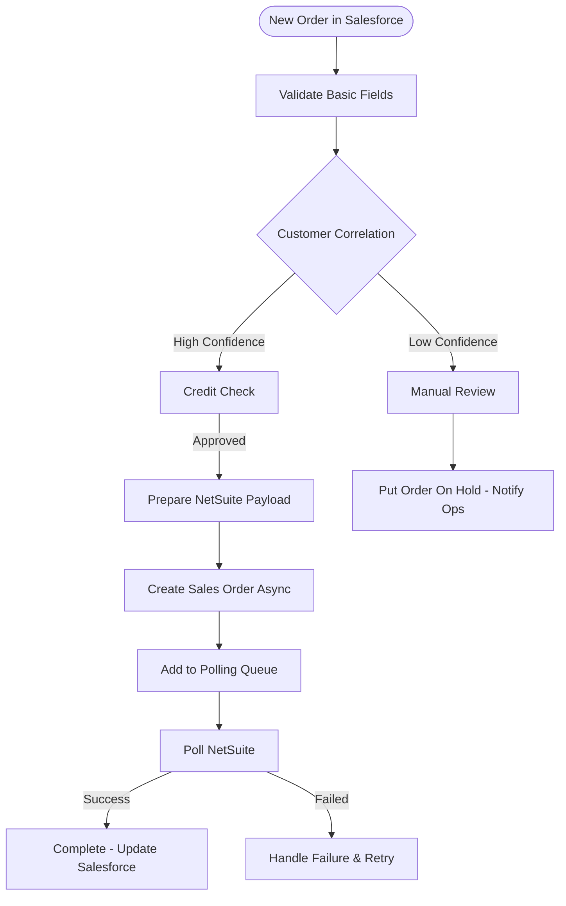
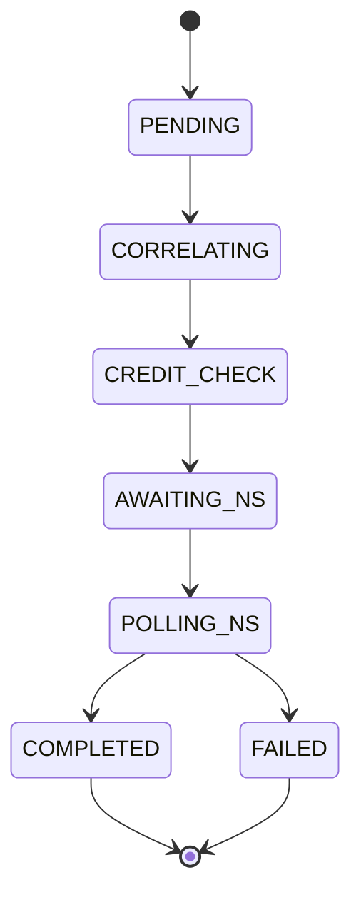
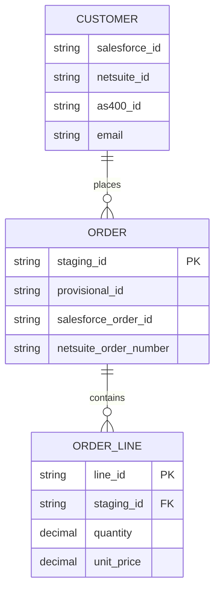
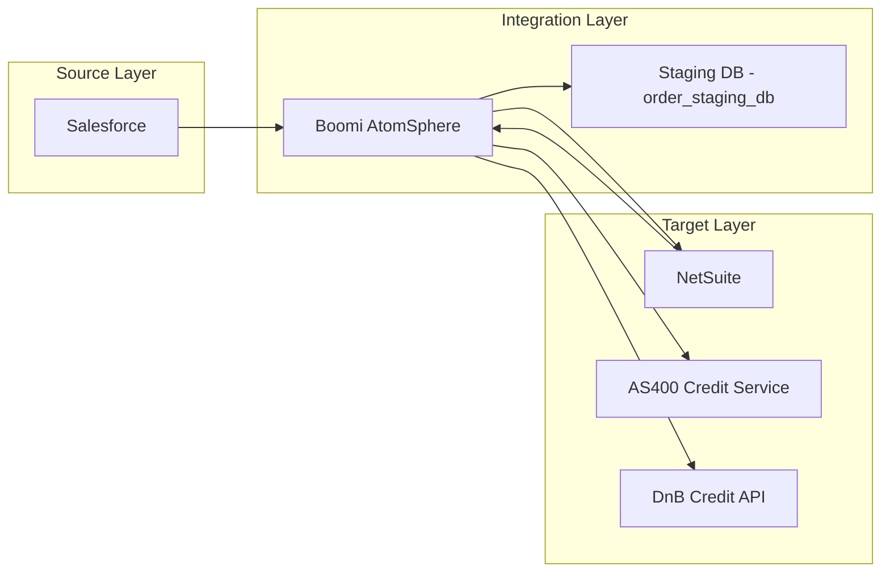

# Design Document: Salesforce to NetSuite Sales Order Integration

## Executive Summary
We will implement a Boomi-orchestrated integration to synchronize sales orders from Salesforce into NetSuite, provide real-time order status and order number back to Salesforce, and incorporate credit checks from the legacy AS/400 and D&B. The solution uses a persistent staging database (AWS RDS PostgreSQL) for correlation, provisional ID management, and reliable retry/polling orchestration. The recommended phased implementation reduces risk and delivers business value quickly.

## Problem Statement
Current order processing is manual, error-prone, and relies on inconsistent data across multiple systems (Salesforce, NetSuite, AS/400 credit system). Key pain points:
- Manual order entry and reconciliation, causing delays and errors
- Customer correlation issues across systems (generic emails, missing Tax IDs/DUNS)
- Asynchronous NetSuite order creation requiring polling to obtain order numbers
- Rate-limited D&B credit checks and legacy AS/400 credit data with certificate-based SOAP authentication
- Subsidiary routing logic exists only in Excel with no audit trail
- Inconsistent product master data and custom products created in Salesforce

## Proposed Solution
A Boomi AtomSphere orchestration will process incoming Salesforce orders, persist them into a staging DB for correlation and validation, call credit services (AS/400 and D&B) with smart caching, and create NetSuite sales orders asynchronously. A polling mechanism in the staging DB will retrieve NetSuite order results, then update Salesforce with the NetSuite order number and status. An auditable subsidiary decision service will replace Excel logic. The solution is phased to deliver core functionality first and tackle complex items (credit, inventory, custom products) in later phases.

### Integration Approach
- Orchestration: Boomi AtomSphere as central orchestrator
- Persistence: AWS RDS PostgreSQL staging database (order_staging_db)
- APIs: Salesforce REST (v59.0), NetSuite REST v2 (SuiteTalk REST), AS/400 SOAP, D&B REST
- Communication: Boomi direct calls to APIs; NetSuite webhooks for status updates; Boomi polls NetSuite when needed
- Error handling: retries, exponential backoff, circuit breakers, manual review queue
- Security: OAuth2/JWT for Salesforce, OAuth2/TBA for NetSuite, client certificate for AS/400, TLS for all transport

### Key Components
- Salesforce (source of truth for order entry)
- Boomi AtomSphere (orchestration, transforms)
- Staging DB (AWS RDS PostgreSQL) for correlation, polling queue, and caching
- NetSuite (target ERP) with async create + webhook for updates
- AS/400 Credit Service (legacy SOAP)
- D&B Credit API (rate-limited) with cache
- Monitoring & Alerting (Boomi dashboards, CloudWatch, PagerDuty)

## Technical Architecture

### System Architecture Diagram

### Data Flow Sequence Diagram

### Process Flow Diagram

### State Transition Diagram

### Entity Relationship Diagram

### Component Interaction Diagram

## Implementation Plan
Phased rollout to reduce risk and deliver value quickly.

### Phase Breakdown
- Phase 1 (6 weeks): Core Order Flow
  - Implement Boomi process to accept Salesforce orders, persist to staging DB, basic correlation for existing customers, create NetSuite sales orders (async), polling and update Salesforce. Implement monitoring and error queue.
  - Success Criteria: Orders flow end-to-end for standard products and known customers; NetSuite order number returned and populated in Salesforce.

- Phase 2 (6 weeks): Credit + Inventory + Subsidiary Decision
  - Integrate AS/400 credit SOAP API (client certificate), D&B credit API with caching and rate-limit handling, inventory status mapping/validation, implement subsidiary decision engine (replace Excel), unit tests and audit trail.
  - Success Criteria: Credit checks performed with fallback cache, subsidiary decisions driven by engine, inventory validation prevents invalid orders.

- Phase 3 (6 weeks): Advanced Features
  - Handle custom products workflow (manual creation or on-demand creation in NetSuite), pricing contract overrides, returns/RMAs, rework commission Lambda to trigger on events, full reconciliation and reporting.
  - Success Criteria: Custom products handled, pricing fidelity maintained, returns processed correctly, commission calculation updated to event-driven.

### Data Mappings
Summary of key mappings (full CSV kept in project repo):
- Order Header
  - Provisional_Order_ID -> custbody_provisional_id in NetSuite
  - Account__c -> entity (requires correlation via customer_correlation_map)
  - Order_Date__c -> tranDate
  - Order_Total__c -> total (NetSuite calculates but pass as validation)
- Order Line
  - Product2Id -> item (NetSuite internalId via mapping)
  - Quantity__c -> quantity (validate item type: integer for inventory, decimal for services)
  - Unit_Price__c -> rate (NetSuite contract pricing may override)
- Transformations
  - Inventory_Status_Text__c (free text) -> shipStatus standardized mapping (plenty -> In Stock, none -> Backordered, check warehouse -> Unknown->manual review)
  - Special_Terms__c -> description (truncate to 4000 chars)
  - Credit fields: use staging credit cache table; if D&B rate limits reached, use cache if <72 hours old

(See attached mapping CSV: salesforce-netsuite-field-mapping.csv for full details)

### Error Handling Strategy
- Retry Logic: Exponential backoff for transient API errors; configurable max retries (default 3 for NS create, 36 poll attempts for 3 minutes).
- Circuit Breaker: On 5 consecutive failures to AS/400 or NetSuite, trigger a 5-minute lockout and alert on-call.
- Polling Queue: Persist NetSuite transactionId and poll until completed or timeout; move to manual review on timeout.
- Manual Review Queue: Orders with low correlation confidence, custom product pending creation, or unresolved credit failures are flagged and routed to business ops.
- Logging & Audit: All requests/responses stored in integration_errors and audit_log tables for 7+ years as required.

## Success Metrics
- End-to-end order sync latency: <5 minutes (target), <1 hour acceptable during extreme peak
- NetSuite create success rate: >99% for standard products and known customers
- Manual intervention reduction: 80% reduction in manual order entry
- Credit check cache hit rate: >80% during peak to avoid D&B rate limits
- System uptime: 99.9% for integration components

## Technical Specifications

### Database Schema
Staging DB (order_staging_db) core elements:
- staging_orders: primary table for order correlation, provisional ID, processing status, timestamps, error fields and correlation confidence. (See schema in staging-database-schema.md)
- staging_order_lines: line item details, product correlation status, inventory and vendor info.
- customer_correlation_map: persistent mapping across Salesforce, NetSuite, and AS/400.
- credit_check_cache: caching for AS/400 and D&B credit data with expiry and api_calls_today for rate monitoring.
- netsuite_polling_queue: stores transactionId, poll status and attempts, next_poll_at, timeout_at.
- integration_errors and audit_log: detailed request/response capture and event trail.

(Full CREATE TABLE statements are included in the staging DB schema document provided to the engineers.)

### API Integrations
- Salesforce
  - Use OAuth2 JWT Bearer for integration user; create orders via the Sales_Order__c sObject; update with PATCH when NetSuite info available; support Platform Events for status notifications.
  - Key limits: 10 req/sec burst recommended, monitor org limits.
- NetSuite
  - SuiteTalk REST v2: Create salesOrder via /record/v1/salesOrder (async pattern). Poll /transaction/v1/status/{transactionId} until record available.
  - Respect NetSuite concurrency and request rate limits; use webhooks for status changes when possible.
- AS/400 Credit Service
  - SOAP 1.2 over HTTPS with X.509 client certificate authentication; EBCDIC conversions required for batch exports; watch maintenance windows and German time zone timings.
- D&B
  - REST API with rate limits (100 calls/hour in current contract); implement caching for 72 hours.

### Transformation Rules
- Date format conversions (Salesforce ISO -> NetSuite YYYY-MM-DD), decimal separators normalized to dot, character set conversions for AS/400 EBCDIC fields.
- Inventory quantity: If NetSuite item type is inventory (integer only) and Salesforce quantity is decimal, reject or flag for manual resolution.
- Pricing: Apply contract pricing lookup before setting rate; if NetSuite overrides, capture both quoted and actual prices for commission reconciliation.
- Provisional ID pattern: PROV-{YEAR}-{SEQUENCE}

## Risks and Mitigations
- AS/400 SOAP Certificate Renewal (Operational Risk)
  - Mitigation: Automate certificate renewal process where possible; maintain a dedicated Windows environment for manual renewals and document steps; rotate certificates well before expiry.
- D&B Rate Limits
  - Mitigation: Implement credit_check_cache with 72-hour TTL, use cache-first strategy, degrade to manual review when cache stale and API unavailable.
- Subsidiary Decision Logic in Excel (Compliance Risk)
  - Mitigation: Migrate rules to subsidiary decision engine in staging DB; implement audit trail and version control; schedule cutover post-quarter.
- Data Quality (generic emails, missing tax IDs)
  - Mitigation: Multi-key correlation strategy (AS400 ID, DUNS, tax ID, email, fuzzy name/address); flag low confidence for manual review.
- Custom Products
  - Mitigation: Block order creation until custom product is created in NetSuite or route the order to manual fulfillment path; introduce a workflow to expedite NetSuite creation.
- Async NetSuite Processing and Polling Timeouts
  - Mitigation: Use polling queue with 3-minute timeout default, escalate to manual review and reconciliation processes; implement alerts for long-running polls.

## Timeline
- Project Kickoff: Week 0
- Phase 1 Delivery: Weeks 1-6 (Core Order Flow)
- Phase 2 Delivery: Weeks 7-12 (Credit, Inventory, Subsidiary Engine)
- Phase 3 Delivery: Weeks 13-18 (Custom Products, Pricing, Returns)
- Testing & UAT: Parallel to each phase with final acceptance at end of Phase 3

---
*Appendices & Artifacts*
- Source artifacts used to create this design: requirements-client-draft.md, sales-order-technical-discussion-transcript.md, integration-platform-meeting-transcript.md, field-mapping-workshop-transcript.md.
- API specifications: salesforce-api-spec.md, netsuite-api-spec.md, as400-legacy-api-spec.md.
- Data mappings CSV: salesforce-netsuite-field-mapping.csv
- Staging DB schema: staging-database-schema.md
- Subsidiary matrix and crisis notes: subsidiary-mapping-matrix.csv, subsidiary-mapping-crisis-transcript.md

---
*Generated from template: design-doc.md*
