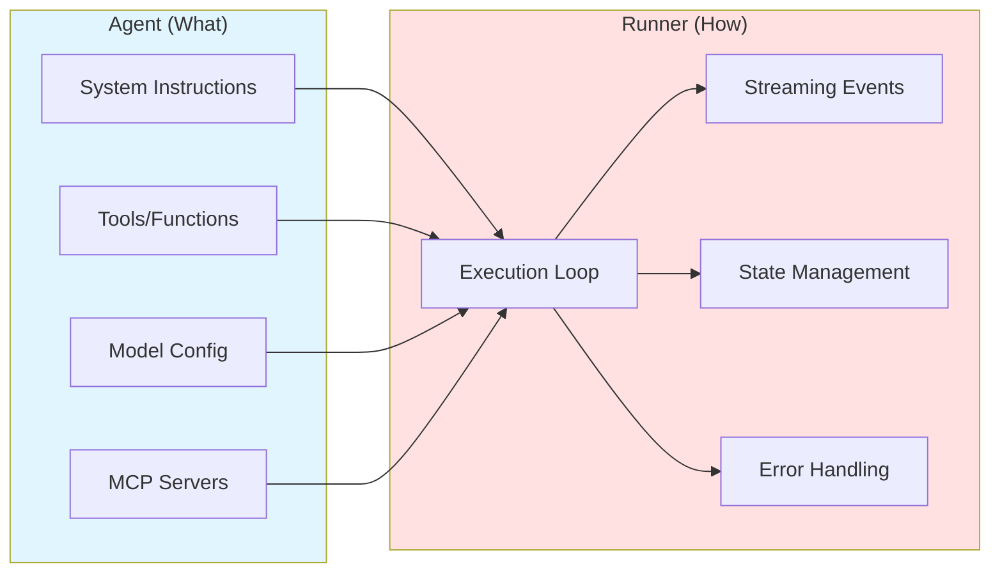
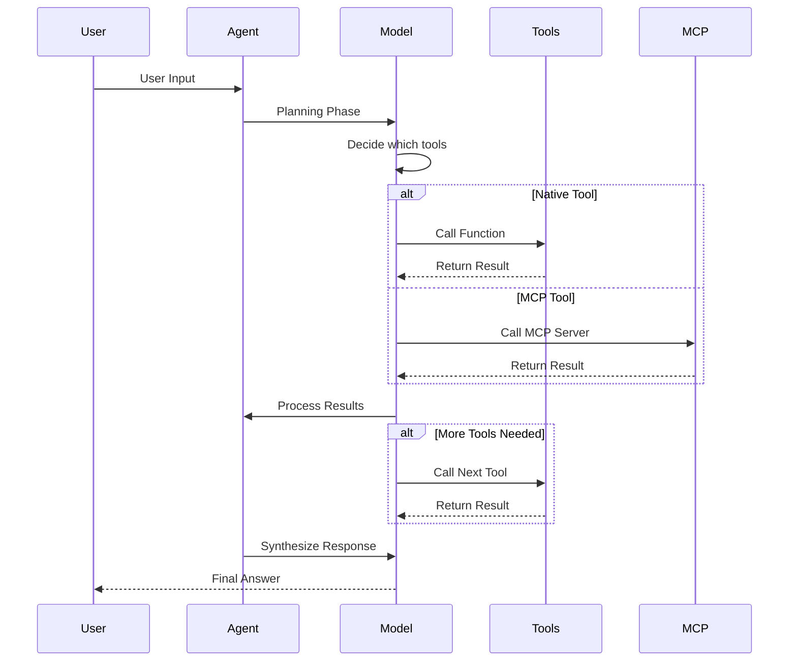
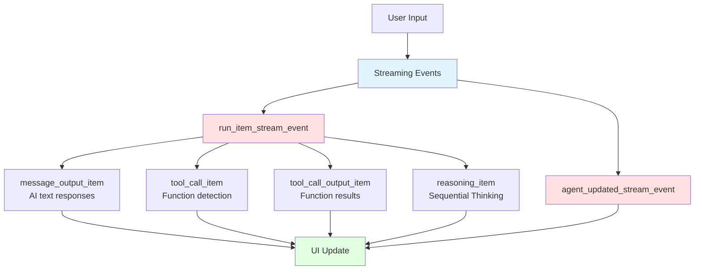
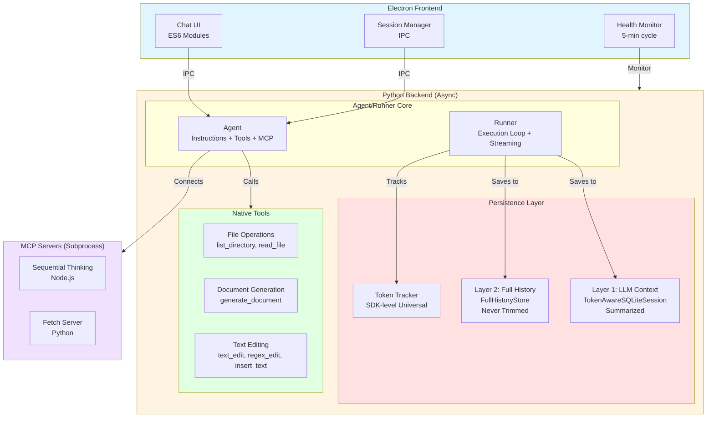
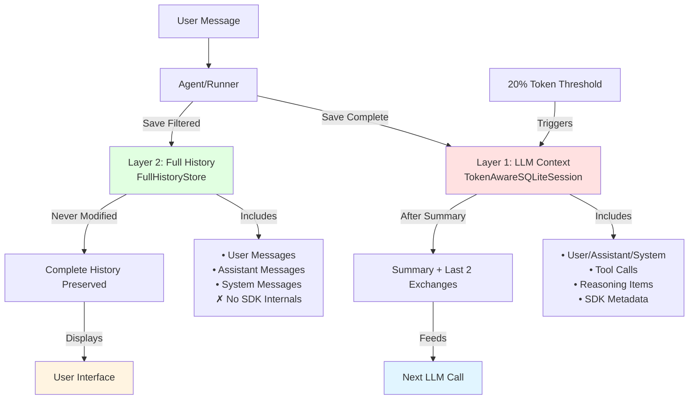
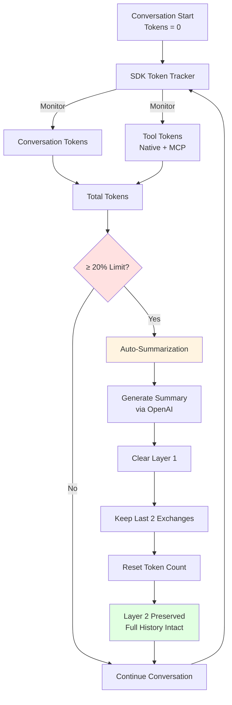
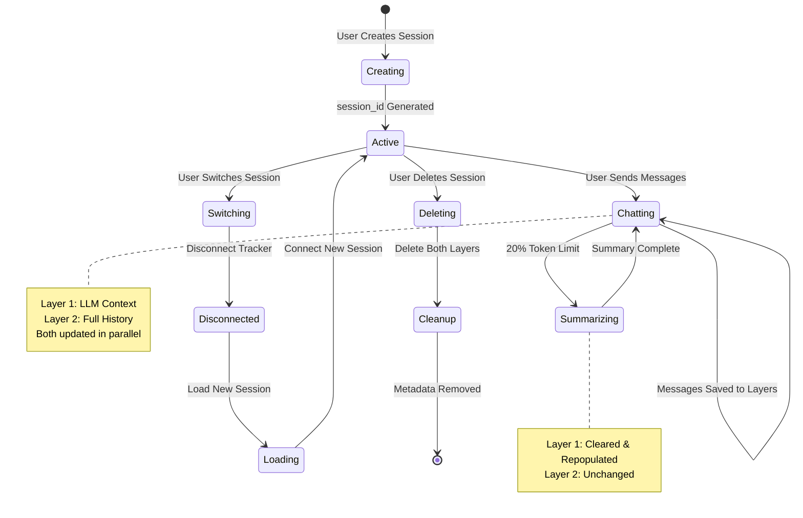

# AI Agents & Chat Juicer
## From Fundamentals to Production Implementation

---

## Part 1: Agent Fundamentals

---

### What Are AI Agents?

**Traditional Chatbots** (Conversational)
- Single request → Single response
- No tool usage or external actions
- Limited to text generation
- No memory of context beyond conversation
- Example: Basic ChatGPT interface

**AI Agents** (Agentic)
- Autonomous task execution
- Tool calling & function orchestration
- Multi-step reasoning & planning
- Persistent state management
- Example: Code interpreter, web browsing, file operations

---

### The Agent/Runner Pattern

**Core Concept**: Separation of concerns between agent definition and execution



**Benefits**:
- Automatic tool orchestration (no manual loops)
- Native streaming support
- Built-in state management
- MCP server integration
- Simplified error handling

---

### The Message Array Pattern

**Core Data Structure for Conversations**

Every API request includes the full conversation history as an array of messages:

```json
[
    {
        "role": "system",
        "content": "You are a helpful assistant with access to weather information"
    },
    {
        "role": "user",
        "content": "Hello!"
    },
    {
        "role": "assistant",
        "content": "Hi! How can I help?"
    },
    {
        "role": "user",
        "content": "What's the weather in San Francisco?"
    },
    {
        "role": "assistant",
        "content": null,
        "tool_calls": [
            {
                "id": "call_abc123",
                "type": "function",
                "function": {
                    "name": "get_weather",
                    "arguments": "{\"location\": \"San Francisco\"}"
                }
            }
        ]
    },
    {
        "role": "tool",
        "tool_call_id": "call_abc123",
        "name": "get_weather",
        "content": "{\"temperature\": 72, \"conditions\": \"partly cloudy\", \"humidity\": 65}"
    },
    {
        "role": "assistant",
        "content": "The current weather in San Francisco is 72°F and partly cloudy, with 65% humidity. It's a nice day!"
    }
]
```

**Key Points**:
- **System message**: Instructions/behavior definition (sets AI personality)
- **User messages**: Human input to the model
- **Assistant messages**: AI responses (can include tool_calls instead of content)
- **Tool messages**: Function call results (added dynamically by application)
- Each request includes full conversation context → token accumulation over time

**Important Implications**:
- Array grows with each turn → need summarization strategies
- Order matters - conversation flows sequentially
- Models are stateless - "reborn" on every request
- Application must manage conversation history

---

### The Agent Loop Pattern

**Traditional Orchestration** (Manual Implementation):

```
1. Send user message → API
2. Receive response
3. Check if function call needed
4. If function_call:
       a. Execute function locally
       b. Add result to messages array
       c. Send entire array back to API (LOOP)
5. Display final response to user
```

**Challenges with Manual Approach**:
- Complex state management (~200+ lines of orchestration)
- Error handling at each step
- Manual function call loop implementation
- No built-in streaming support
- Boilerplate code for common patterns

**Agent/Runner Solution**:
- Framework handles orchestration automatically
- Built-in streaming events
- Automatic function discovery
- Error recovery patterns
- Native MCP server support

---

### Tool Calling & Orchestration

**How The Agent/Runner Pattern Works**:



**Key Features**:
- Automatic function discovery from schemas
- Parallel tool execution when possible
- Tool result validation & error recovery
- Token tracking for all operations
- No manual loop implementation needed

---

### Model Context Protocol (MCP)

**What Is MCP?**
- Open protocol for connecting AI systems to data sources
- Server-based architecture for tool integration
- Standardized interface for diverse capabilities

**MCP Server Examples**:
- **Sequential Thinking**: Multi-step reasoning with revision
- **Fetch**: HTTP/HTTPS web content retrieval
- **Filesystem**: File operations (read, write, search)
- **GitHub**: Repository management & code search
- **Database**: SQL query execution

**Advantages**:
- Vendor-neutral standard
- Reusable across applications
- Community-driven ecosystem
- No custom integration code needed

---

### Streaming & Async Execution

**Event-Driven Architecture**:



**Benefits**:
- Real-time UI updates
- Responsive user experience
- Efficient resource utilization
- Non-blocking operations
- Progress visibility

---

## Part 2: Chat Juicer Architecture

---

### What Is Chat Juicer?

**Production-Grade Desktop AI Assistant**

Built with:
- **Frontend**: Electron (cross-platform desktop)
- **Backend**: Python 3.9+ (async/await)
- **AI**: Azure OpenAI (Agent/Runner pattern)
- **MCP**: Sequential Thinking + Fetch servers

**Key Differentiators**:
- Two-layer persistence architecture
- Token-aware session management
- Multi-session support
- Enterprise logging & monitoring
- Full type safety (mypy strict + Pydantic)

---

### High-Level Architecture



---

### Layered Persistence Architecture

**The Problem We Solved**:
- LLM needs token-optimized context (summarization required)
- Users need complete conversation history (no message loss)
- Single storage layer forces a tradeoff



**Our Solution**: Two-Layer Architecture

**Layer 1: LLM Context** (Optimized)
- SQLite storage via `TokenAwareSQLiteSession`
- Includes SDK internals (tool calls, reasoning, metadata)
- Auto-summarization at 20% of model limit
- Example: GPT-5 triggers at 54,400 tokens (272k × 0.2)

**Layer 2: UI Display** (Complete)
- SQLite storage via `FullHistoryStore`
- User/assistant/system messages only
- Never summarized - append-only
- Fast session switching without buffer overflow

---

### Layered Persistence: Technical Details

**Storage Schema**:

```sql
-- Layer 1: LLM Context (SDK managed)
agent_sessions (session_id, created_at)
agent_messages (id, session_id, message_data [JSON], created_at)

-- Layer 2: Full History (app managed)
full_history_chat_[SESSION_ID] (
    id INTEGER PRIMARY KEY,
    role TEXT NOT NULL,
    content TEXT NOT NULL,
    metadata TEXT,
    created_at TIMESTAMP
)

-- Metadata (JSON file)
data/sessions.json {
    current_session_id: string,
    sessions: {
        [session_id]: {
            title, created_at, last_used,
            message_count, accumulated_tool_tokens
        }
    }
}
```

---

### Token-Aware Session Management

**Smart Token Tracking**:



1. **SDK-Level Tracking** (Automatic)
   - Monkey-patches OpenAI SDK for universal tracking
   - Captures all tool tokens (native + MCP + future agents)
   - Exact counting via tiktoken (no estimates)
   - LRU caching for performance

2. **Threshold Monitoring**
   - Total tokens = conversation + accumulated tool tokens
   - Triggers at 20% of model limit
   - Example: 54,400 / 272,000 for GPT-5

3. **Auto-Summarization**
   - Generates concise summary of conversation
   - Preserves last 2 user-assistant exchanges
   - Resets token count while maintaining context
   - Layer 1 cleared, Layer 2 preserved

---

### Multi-Session Support

**Session Lifecycle**:



**Session Operations**:

**Create Session**
- Generate unique session_id (8 hex chars)
- Initialize both storage layers
- Save metadata (title, timestamps)
- Connect to token tracker

**Switch Session**
- Disconnect current session from tracker
- Load Layer 1 (LLM context) for model
- Load Layer 2 (full history) for UI
- Restore token counts from metadata
- Connect new session to tracker

**Delete Session**
- Disconnect from tracker (if active)
- Delete Layer 1 storage (LLM context table)
- Delete Layer 2 storage (full history table)
- Remove metadata from sessions.json

**Benefits**:
- Isolated conversation contexts
- Fast switching (< 100ms typical)
- No cross-contamination
- Persistent across app restarts

---

### Native Functions

**Document Operations**:
- `list_directory` - Directory listing with metadata
- `read_file` - Multi-format support (PDF, Word, Excel, HTML, etc.)
- `generate_document` - Template-based document creation

**Text Editing**:
- `text_edit` - Find and replace exact text
- `regex_edit` - Pattern-based editing
- `insert_text` - Add content before/after markers

**All Functions**:
- Fully async for non-blocking execution
- Exact token counting for cost tracking
- Structured logging with session correlation
- Automatic registration via tool registry

---

### MCP Server Integration

**Sequential Thinking** (Node.js)
- Multi-step reasoning with structured output
- Revision capabilities (can correct itself)
- Branching logic (explore alternatives)
- Hypothesis generation & testing
- Use case: Complex problem decomposition

**Fetch Server** (Python)
- HTTP/HTTPS web content retrieval
- Automatic format handling (HTML, JSON, XML)
- Custom headers & parameters
- GET/POST request support
- Use case: Real-time web data access

**Integration Pattern**:
```python
# Setup
mcp_servers = await setup_mcp_servers()

# Agent creation with MCP
agent = Agent(
    name="Chat Juicer",
    model=deployment,
    instructions=SYSTEM_INSTRUCTIONS,
    tools=NATIVE_TOOLS,
    mcp_servers=mcp_servers  # Automatic discovery
)
```

---

### Enterprise Features

**Production-Ready Components**:

1. **Structured Logging**
   - JSON format (conversations.jsonl, errors.jsonl)
   - Log rotation (10MB max, 5 backups)
   - Session correlation (all logs tagged with session_id)
   - Token tracking in every function call

2. **Health Monitoring**
   - Python backend health checks every 5 minutes
   - Auto-recovery from connection errors
   - State machine (CONNECTED/DISCONNECTED/RECONNECTING/ERROR)
   - Graceful shutdown handling

3. **Type Safety**
   - Full mypy strict compliance (Python)
   - Pydantic runtime validation
   - Protocol typing for SDK integration
   - TypedDict for data structures

4. **Error Handling**
   - Rate limit detection & user-friendly messages
   - Connection error recovery
   - Tool execution error tracking
   - Comprehensive exception logging

---

### Performance Optimizations

**Token Management**:
- LRU cache for token counting (last 128 unique texts)
- Pre-cached IPC templates (reduced serialization)
- Content optimization (removes redundant whitespace)
- Exact counting via tiktoken (not estimates)

**Memory Management**:
- BoundedMap for frontend state (auto-eviction)
- Automatic log rotation (prevents disk fill)
- Session-scoped tool token accumulation
- Strategic garbage collection

**Concurrency**:
- Full async/await architecture
- Non-blocking I/O operations
- Parallel tool execution (when independent)
- Streaming for real-time responsiveness

---

### Technology Stack

**Frontend**:
- Electron 38.1.2 (cross-platform desktop)
- ES6 modules (modular renderer architecture)
- Markdown rendering (marked.js + DOMPurify)
- State management (BoundedMap + AppState pub/sub)

**Backend**:
- Python 3.9+ (modern async features)
- AsyncOpenAI client (Azure OpenAI)
- openai-agents 0.2.0+ (Agent/Runner + SQLiteSession)
- markitdown (multi-format document conversion)
- tiktoken (exact token counting)
- Pydantic 2.5+ (validation + settings)

**Infrastructure**:
- SQLite (dual-layer persistence)
- JSON (session metadata)
- MCP servers (Node.js + Python subprocesses)

---

### Development Tooling

**Quality Assurance**:
- Black (code formatting)
- Ruff (linting with auto-fix)
- mypy (strict type checking)
- pre-commit hooks (automated checks)
- Biome (JavaScript/TypeScript linting)

**Makefile Commands** (40+ operations):
```bash
make setup        # First-time installation
make run          # Start application
make dev          # Development mode (DevTools)
make quality      # format + lint + typecheck
make logs         # Structured log streaming
make db-explore   # Database inspection tools
make health       # System diagnostics
```

**Cross-Platform**:
- npm scripts (Windows/macOS/Linux)
- Makefile (macOS/Linux convenience)
- Git Bash/WSL (Windows alternative)

---

### Model Support

**Token Limits** (Input Context):

| Model | Context Window | Trigger Point (20%) |
|-------|----------------|---------------------|
| GPT-5 | 272,000 tokens | 54,400 tokens |
| GPT-4o | 128,000 tokens | 25,600 tokens |
| GPT-4 | 128,000 tokens | 25,600 tokens |
| GPT-3.5-turbo | 15,360 tokens | 3,072 tokens |

**Automatic Detection**:
- Model limit lookup from deployment name
- Conservative fallback (15k tokens)
- Dynamic trigger point calculation
- Per-session token tracking

---

### Database Exploration

**Built-in Tools**:
```bash
make db-compare    # Compare Layer 1 vs Layer 2 counts
make db-layer1     # View LLM context (includes SDK internals)
make db-layer2     # View UI display (clean conversation)
make db-tools      # Inspect all tool calls
make db-types      # Analyze SDK item type distribution
make db-shell      # Interactive SQLite shell
```

**Use Cases**:
- Debug summarization behavior
- Verify dual-layer persistence
- Analyze token usage patterns
- Understand SDK internal structures
- Validate session cleanup

---

### Real-World Benefits

**For Users**:
- ✅ Never lose conversation history (Layer 2 preservation)
- ✅ Fast session switching (< 100ms typical)
- ✅ Transparent tool execution (streaming progress)
- ✅ Persistent conversations (survive app restarts)
- ✅ Multi-session workflows (parallel contexts)

**For Developers**:
- ✅ Clean separation of concerns (Layer 1 vs Layer 2)
- ✅ Type-safe codebase (mypy strict + Pydantic)
- ✅ Comprehensive logging (session correlation)
- ✅ Extensible architecture (add MCP servers easily)
- ✅ Production-ready (health monitoring, error recovery)

---

### Project Status

**Current State**: Production-Ready ✓

**Recent Milestones**:
- ✅ Migrated to Agent/Runner pattern (~50% code reduction)
- ✅ Implemented layered persistence (solved message loss)
- ✅ Added SDK-level token tracking (universal coverage)
- ✅ Integrated MCP servers (Sequential Thinking + Fetch)
- ✅ Full type safety (mypy strict compliance)

**Lines of Code**:
- Python Backend: ~3,000 LOC (30 files)
- JavaScript Frontend: ~2,000 LOC (modular ES6)
- Documentation: ~2,000 lines (README + guides)

**Test Coverage**:
- 1,192 tests (614 Python + 578 JavaScript) with 87% coverage
- Comprehensive test suite with modern tooling (pytest, Vitest)
- Production monitoring (5-min health checks)
- Comprehensive error logging

---

## Key Takeaways

---

### Agent Fundamentals Summary

1. **Agents ≠ Chatbots**: Autonomous execution vs conversational
2. **Agent/Runner Pattern**: Separation of "what" from "how"
3. **Tool Orchestration**: Automatic function discovery & execution
4. **MCP Standard**: Vendor-neutral protocol for capabilities
5. **Streaming Events**: Real-time progress & responsiveness

---

### Chat Juicer Innovations

1. **Layered Persistence**: Solves LLM optimization vs UX tradeoff
2. **Token-Aware Sessions**: Automatic summarization at 20% threshold
3. **Multi-Session Management**: Isolated contexts with fast switching
4. **SDK-Level Tracking**: Universal token capture via monkey-patching
5. **Production-Grade**: Health monitoring, structured logging, type safety

---

### Why This Matters

**For The Industry**:
- Demonstrates Agent/Runner pattern in production
- Proves layered persistence viability
- Shows MCP integration benefits
- Validates async Python + Electron architecture

**For This Project**:
- Solves real problems (message loss, token limits)
- Scalable architecture (add MCP servers easily)
- Maintainable codebase (type safety, modularity)
- Production-ready (monitoring, recovery, logging)

---

## Questions?

**Live Demo**: Session management, tool calling, summarization

**Documentation**: README, architecture guides, API docs

**Code**: https://github.com/yourusername/chat-juicer

**Contact**: [Your contact info]

---

## Appendix

---

### Additional Resources

**OpenAI Agents Documentation**:
- Agent/Runner pattern guide
- Tool calling best practices
- MCP server development

**Chat Juicer Documentation**:
- `docs/agent-runner-migration-analysis.md`
- `docs/layered-persistence-architecture.md`
- `docs/token-streaming-implementation.md`

**MCP Resources**:
- Model Context Protocol specification
- Community MCP servers
- Server development guides

---

### Future Enhancements

**Planned Features**:
- Multi-agent collaboration (agent handoffs)
- Session export/import (backup & sharing)
- Full-text conversation search
- Custom MCP server templates
- Performance dashboard (token analytics)

**Research Areas**:
- Adaptive summarization strategies
- Intelligent context pruning
- Multi-modal agent capabilities
- Distributed agent orchestration

---

### Performance Metrics

**Typical Operation Times**:
- Session creation: < 50ms
- Session switching: < 100ms (Layer 2 load)
- Summarization: 2-5 seconds (depends on history size)
- Tool execution: Varies by function (file I/O, web fetch, etc.)
- Token counting: < 5ms (with LRU cache)

**Storage Efficiency**:
- ~1MB per 1,000 messages (Layer 2)
- ~2-3MB per session (Layer 1 with SDK internals)
- Log rotation prevents unbounded growth
- Session cleanup removes both layers

---

### Troubleshooting Tips

**Common Issues**:

1. **"API key not found"**
   - Check `src/.env` configuration
   - Run `make health` for diagnostics

2. **MCP server not working**
   - Verify global installation: `npm list -g --depth=0`
   - Reinstall: `make install-mcp`

3. **Session switching slow**
   - Check Layer 2 table size: `make db-layer2`
   - Consider pagination for 1000+ messages

4. **Memory usage high**
   - BoundedMap prevents unbounded growth
   - Check log file rotation (10MB max)
   - Monitor session count

---

### Configuration Reference

**Environment Variables** (`src/.env`):
```bash
AZURE_OPENAI_API_KEY=your-api-key
AZURE_OPENAI_ENDPOINT=https://resource.openai.azure.com/
AZURE_OPENAI_DEPLOYMENT=gpt-5-mini
OPENAI_AGENTS_DISABLE_TRACING=true
```

**Key Constants** (`src/core/constants.py`):
```python
CONVERSATION_SUMMARIZATION_THRESHOLD = 0.2  # 20%
KEEP_LAST_N_MESSAGES = 2                    # User messages
DOCUMENT_SUMMARIZATION_THRESHOLD = 7000     # Tokens
CHAT_HISTORY_DB_PATH = "data/chat_history.db"
```

**Model Limits**:
```python
MODEL_TOKEN_LIMITS = {
    "gpt-5": 272000,
    "gpt-4o": 128000,
    "gpt-3.5-turbo": 15360,
}
```
