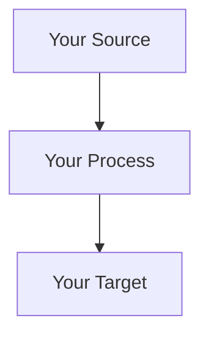
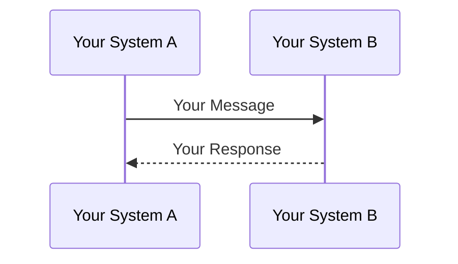
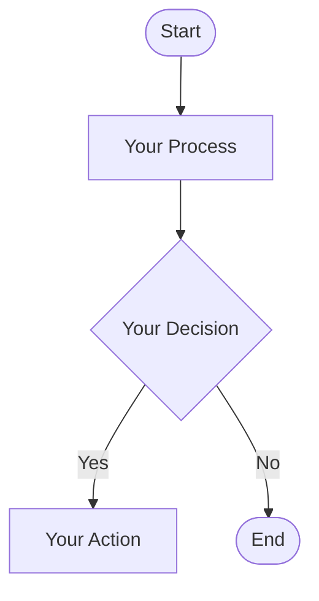
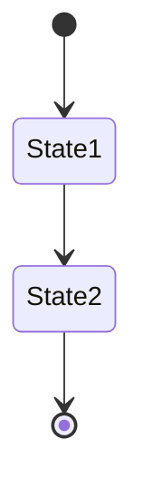
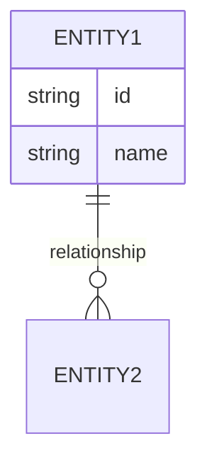
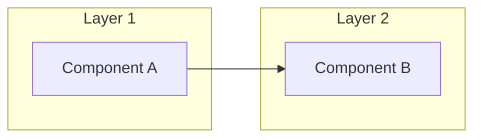
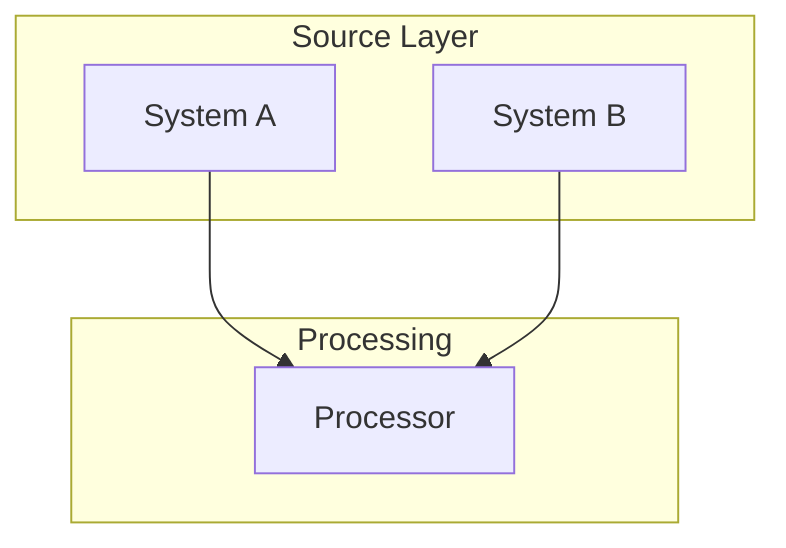
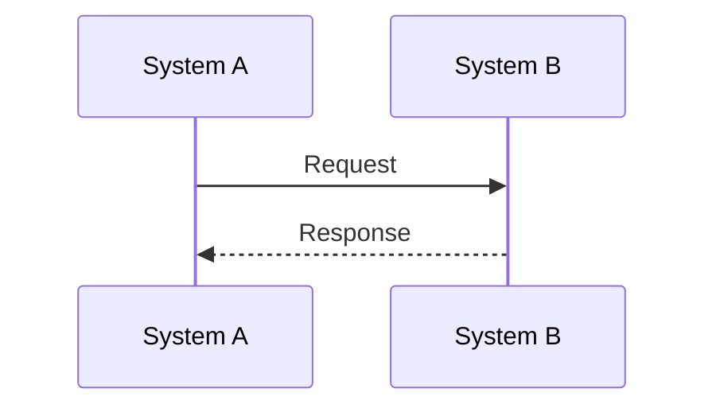
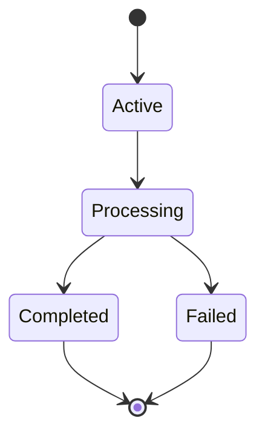
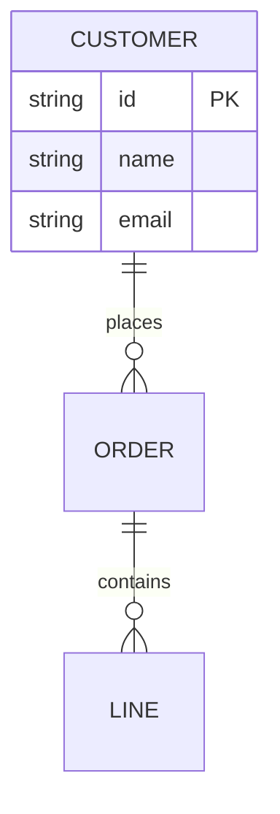

# Design Document: [Provide a clear, descriptive project name that captures the essence of what's being designed]

<!--
MERMAID DIAGRAM GENERATION RULES:
================================

When creating Mermaid diagrams, remember these syntax requirements:

1. Node labels CANNOT contain parentheses - they cause parser errors
2. Instead of parentheses, use: dashes, colons, or just spaces
3. Keep node IDs simple (letters/numbers/underscores only)

Example transformations for clarity:
- Instead of: "System (Production)" use: "System - Production"
- Instead of: "API (v2)" use: "API v2"
- Instead of: "Process (async)" use: "Process Async"
-->

## Executive Summary
[Write a 2-3 paragraph executive summary that captures: 1) The business context and why this project matters, 2) The core technical approach being proposed, 3) The expected impact and key benefits. Keep it high-level and suitable for both technical and non-technical stakeholders.]

## Problem Statement
[Clearly articulate the problem being solved. Include: 1) Current pain points and inefficiencies, 2) Specific challenges users/systems face, 3) Why existing solutions fall short, 4) The cost of not solving this problem. Use concrete examples where possible.]

## Proposed Solution
[Describe your proposed solution at a high level. Cover: 1) The overall approach and methodology, 2) Key technologies or frameworks to be used, 3) How this addresses each problem identified above, 4) Why this approach was chosen over alternatives.]

### Integration Approach
[Detail how the solution integrates with existing systems. Include: 1) Integration points and interfaces, 2) Data exchange formats and protocols, 3) Authentication/authorization approach, 4) Backward compatibility considerations, 5) Migration strategy from current state.]

### Key Components
[List and describe the major components of the solution. For each component include: 1) Component name and purpose, 2) Key responsibilities, 3) Technologies used, 4) Interactions with other components. Format as a bulleted list or subsections.]

## Technical Architecture
[Provide a detailed technical overview. Include: 1) Architectural patterns and principles applied, 2) Technology stack justification, 3) Scalability and performance considerations, 4) Security architecture, 5) Data architecture and storage approach.]

### System Architecture Diagram
[Create a high-level system architecture diagram showing all major components, their relationships, and data flows. Use graph TB or flowchart for clarity. Include external systems, databases, services, and key interfaces.]

REPLACE ABOVE WITH MERMAID like:



### Data Flow Sequence Diagram
[Create a sequence diagram showing the flow of data through the system for key use cases. Include all participants, messages, responses, and any async operations. Focus on the most critical or complex flows.]

REPLACE ABOVE WITH MERMAID like:



### Process Flow Diagram
[Create a flowchart showing the main process flow with decision points, error handling paths, and outcomes. Use flowchart TD with appropriate shapes: rectangles for processes, diamonds for decisions, rounded rectangles for start/end.]

REPLACE ABOVE WITH MERMAID like:



### State Transition Diagram
[Create a state diagram showing the various states of key entities or processes and the transitions between them. Include initial and final states, transition triggers, and any guard conditions.]

REPLACE ABOVE WITH MERMAID like:



### Entity Relationship Diagrams
[Create various ER diagrams showing the main data entities, their attributes, and relationships. Include cardinality, primary keys, and foreign keys. Focus on the core domain model. Each system included in the integration should have it's own discrete ERD, if you have enough information available.]

REPLACE ABOVE WITH MERMAID like:



### Component Interaction Diagram
[Create a component diagram showing how different layers or modules interact. Use subgraphs to group related components. Show dependencies and communication patterns between components.]

REPLACE ABOVE WITH MERMAID like:


### Data Mappings
[Define data transformation and mapping rules. Include: 1) Source to target field mappings, 2) Data type conversions, 3) Validation rules, 4) Default values and constants, 5) Complex transformation logic. Consider using tables for clarity.]

### Error Handling Strategy
[Describe the error handling approach. Include: 1) Error classification and severity levels, 2) Logging and monitoring strategy, 3) Retry mechanisms and circuit breakers, 4) Error recovery procedures, 5) User notification approach, 6) Escalation procedures.]

## Technical Specifications
[Provide detailed technical specifications. Include: 1) Hardware requirements, 2) Software dependencies and versions, 3) Network requirements, 4) Storage requirements, 5) Performance specifications, 6) Compliance and regulatory requirements.]

### Database Schema
[Detail the database design. Include: 1) Table structures with column definitions, 2) Indexes and constraints, 3) Relationships and foreign keys, 4) Stored procedures or functions if applicable, 5) Data retention policies. Consider using SQL DDL or table format.]

### API Integrations
[Document all API integrations. For each API include: 1) API name and purpose, 2) Authentication method, 3) Key endpoints used, 4) Request/response formats, 5) Rate limits and quotas, 6) Error handling approach, 7) Fallback mechanisms.]

### Transformation Rules
[Define data transformation logic. Include: 1) Business rules for data processing, 2) Calculation formulas, 3) Conditional logic and branching, 4) Data enrichment rules, 5) Aggregation and summarization logic. Use pseudocode or structured format for complex rules.]

## Risks and Mitigations
[Identify risks and mitigation strategies. For each risk provide: 1) Risk description, 2) Probability (High/Medium/Low), 3) Impact (High/Medium/Low), 4) Mitigation strategy, 5) Contingency plan. Format as a table.. Consider technical, business, and operational risks.]

---
*Generated from template: design-doc.md*

<!--
================================================================================
⚠️ STOP HERE WHEN GENERATING DOCUMENTS ⚠️
================================================================================
EVERYTHING BELOW IS FOR TEMPLATE USERS ONLY - DO NOT INCLUDE IN GENERATED DOCS
================================================================================
-->

# APPENDIX: Mermaid Diagram Reference Guide
*This section is ONLY for debugging Mermaid syntax. DO NOT include in generated documents.*

## Quick Mermaid Syntax Reference

### 🚨 CRITICAL RULES - NEVER Use The Below Characters in Labels:
- `{ }` → Interpreted as diamond shape syntax
- `( )` → Causes parsing errors
- `&` → Use "and" instead
- `[ ]` → Reserved for node definition
- `|` → Reserved for separators

⚠️ REMEMBER! Using the characters ABOVE in LABELS will result in a FAILURE! ⚠️

### Safe Label Patterns
```
✅ GOOD                          ❌ BAD
A[System Name]                   A[System (Production)]
B[Credit and Inventory]          B[Credit & Inventory]
C[Message Queue - SQS]           C[Message Queue (SQS)]
D[API v2]                        D[API (v2)]
E[DnB Service]                   E[D&B Service]
```

### Basic Diagram Types

#### System Architecture (graph/flowchart)


#### Sequence Diagram


#### Process Flow


#### State Diagram


#### Entity Relationship


### Common Error Patterns and Fixes

#### The "got PS" Error (Most Common!)
This ALWAYS means parentheses in a label:
```
❌ WRONG                           ✅ CORRECT
CREDIT[Credit Check (cache)]      CREDIT[Credit Check - cache]
DB[Staging DB (order_staging_db)] DB[Staging DB - order_staging_db]
API[REST API (v2)]                API[REST API v2]
ENV[Production (US-EAST)]         ENV[Production US-EAST]
SYSTEM API (Aysnc)                SYSTEM API - Async
```

#### Complete Error Reference
| Error Message | Cause | Example Problem | Fix |
|--------------|-------|-----------------|-----|
| "got PS" | `(` in any label | `A[System (Prod)]` | `A[System Prod]` |
| "got DIAMOND_START" | `{` in label | `A[Data{flow}]` | `A[Dataflow]` |
| "got BLOCK_START" | `{` in entity name | `{ORDER}` in ER diagram | `ORDER` |
| "Expecting TAGEND" | Unclosed bracket | `A[System` | `A[System]` |
| "Expecting SQE" | Space in node ID | `NODE 1[Label]` | `NODE1[Label]` |
| "got ALPHA" | Missing quotes in subgraph | `subgraph My Group` | `subgraph "My Group"` |
| "Syntax error" | Wrong diagram type | Using `graph` syntax in `sequenceDiagram` | Use correct syntax |

#### Node ID vs Label Issues
```
❌ WRONG                    ✅ CORRECT
MY NODE[Label]              MY_NODE[Label]     # Spaces in ID
Node-1[Label]               Node1[Label]       # Dashes in ID
2Node[Label]                Node2[Label]       # Starting with number
node.service[Label]         node_service[Label] # Dots in ID
```

#### Subgraph Title Issues
```
❌ WRONG                    ✅ CORRECT
subgraph My Layer           subgraph "My Layer"
subgraph Layer(1)           subgraph "Layer 1"
subgraph Layer & Core       subgraph "Layer and Core"
```

### Node Shapes
- `A[Rectangle]` - Default
- `A(Rounded)` - Start/End
- `A{Diamond}` - Decision
- `A[(Database)]` - Storage
- `A((Circle))` - Key point

### Arrow Types
- `-->` Solid arrow
- `-.->` Dotted arrow
- `==>` Thick arrow
- `---` Line no arrow

### Remember
1. Keep labels simple
2. No special characters
3. Test incrementally
4. Use proper diagram type for your use case

---
END OF TEMPLATE REFERENCE - DO NOT INCLUDE IN GENERATED DOCUMENTS
