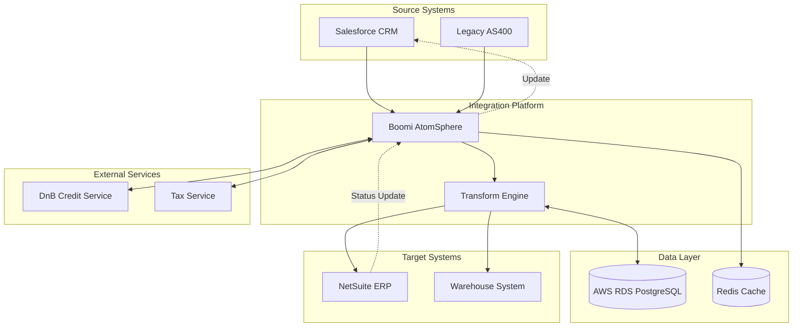
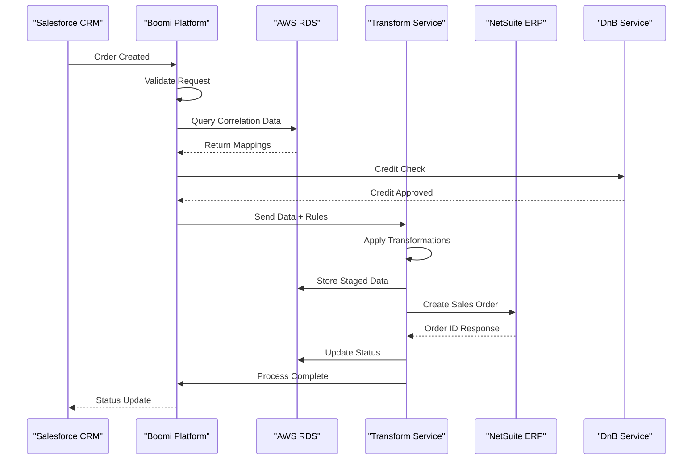
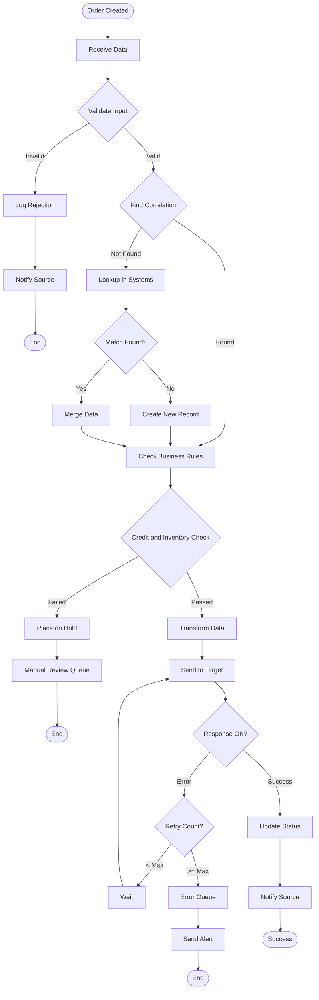
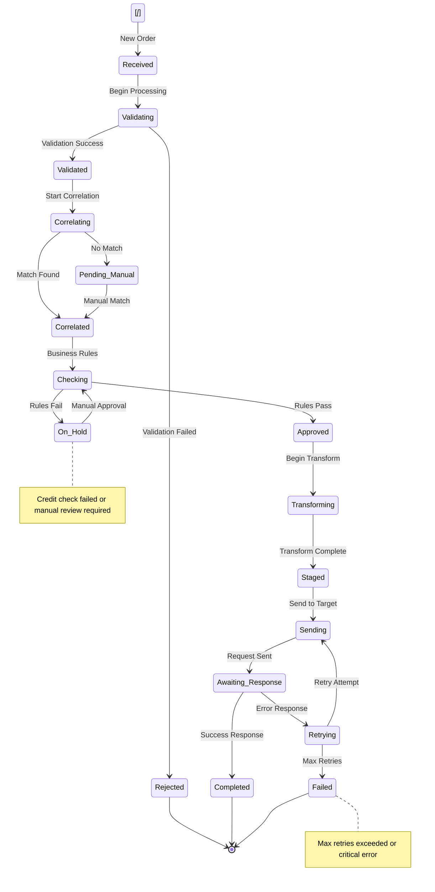
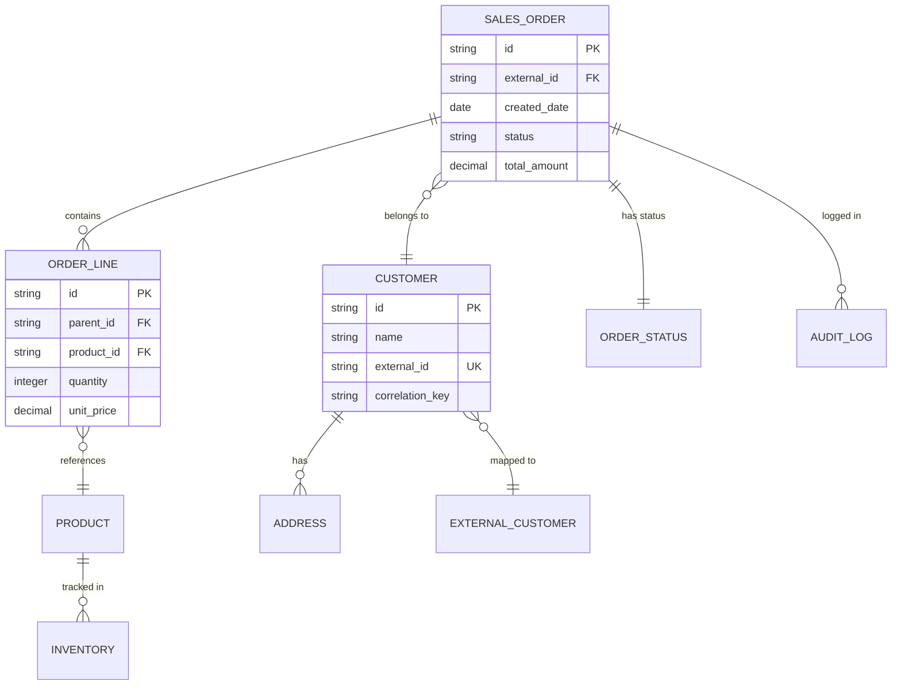
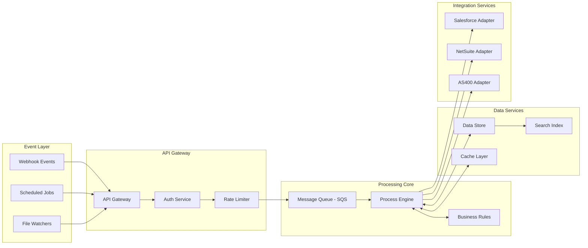

# Design Document: {{project_name}}

<!-- 
TEMPLATE INSTRUCTIONS:
1. Replace {{placeholders}} in text sections with your content
2. INCLUDE ALL MERMAID DIAGRAMS - they are essential parts of the document
3. Adapt the example system names (Salesforce, NetSuite, etc.) to match your actual systems
4. The diagrams are working examples - modify them but keep them in the document
-->

## Executive Summary
{{executive_summary}}

## Problem Statement
{{problem_statement}}

## Proposed Solution
{{proposed_solution}}

### Integration Approach
{{integration_approach}}

### Key Components
{{key_components}}

## Technical Architecture
{{technical_architecture}}

### System Architecture Diagram
{{system_architecture_diagram_placeholder}}

<!-- REPLACE THE ABOVE PLACEHOLDER WITH YOUR MERMAID DIAGRAM FOR YOUR USE CASE. Example below: -->


### Data Flow Sequence Diagram
{{data_flow_sequence_diagram_placeholder}}

<!-- REPLACE THE ABOVE PLACEHOLDER WITH YOUR MERMAID DIAGRAM FOR YOUR USE CASE. Example below: -->


### Process Flow Diagram
{{process_flow_diagram_placeholder}}

<!-- REPLACE THE ABOVE PLACEHOLDER WITH YOUR MERMAID DIAGRAM FOR YOUR USE CASE. Example below: -->


### State Transition Diagram
{{state_transition_diagram_placeholder}}

<!-- REPLACE THE ABOVE PLACEHOLDER WITH YOUR MERMAID DIAGRAM FOR YOUR USE CASE. Example below: -->


### Entity Relationship Diagram
{{entity_relationship_diagram_placeholder}}

<!-- REPLACE THE ABOVE PLACEHOLDER WITH YOUR MERMAID DIAGRAM FOR YOUR USE CASE. Example below: -->


### Component Interaction Diagram
{{component_interaction_diagram_placeholder}}

<!-- REPLACE THE ABOVE PLACEHOLDER WITH YOUR MERMAID DIAGRAM FOR YOUR USE CASE. Example below: -->


## Implementation Plan
{{implementation_plan}}

### Phase Breakdown
{{phase_breakdown}}

### Data Mappings
{{data_mappings}}

### Error Handling Strategy
{{error_handling_strategy}}

## Success Metrics
{{success_metrics}}

## Technical Specifications
{{technical_specifications}}

### Database Schema
{{database_schema}}

### API Integrations
{{api_integrations}}

### Transformation Rules
{{transformation_rules}}

## Risks and Mitigations
{{risks_and_mitigations}}

## Timeline
{{timeline}}

---
*Generated from template: design-doc.md*

<!-- 
================================================================================
STOP! DO NOT INCLUDE ANYTHING BELOW THIS LINE IN GENERATED DOCUMENTS
================================================================================
The content below is ONLY for template users debugging Mermaid syntax issues.
When generating documents, END at the line above that says "Generated from template"
================================================================================
-->

## [TEMPLATE REFERENCE ONLY - NOT FOR GENERATED DOCS] Mermaid Diagram Guidelines

### Critical Rules to Prevent Parsing Errors

**NEVER use these characters in labels:**
- `{ }` - Curly braces (interpreted as diamond shape syntax)
- `( )` - Parentheses (cause parsing errors)
- `[ ]` - Square brackets in labels (reserved for node syntax)
- `&` - Ampersand (use "and" instead)
- `|` - Pipe (reserved for label separators)
- `< >` - Angle brackets (except in HTML tags like `<br/>`)

### Common Parenthesis Traps

**NEVER use parentheses, even for:**
- Acronyms: `Queue (SQS)` → `Queue - SQS` or `SQS Queue`
- Versions: `API (v2)` → `API v2`
- Environments: `Server (Production)` → `Production Server`
- Protocols: `Service (OAuth)` → `OAuth Service`
- Technologies: `Database (MySQL)` → `MySQL Database`
- Clarifications: `System (Legacy)` → `Legacy System`

### The Sales Order Problem

**Problem:** `Sales Order` breaks because `{` means "start diamond shape"

**Solution:** Replace ALL placeholders with actual values:
- `Sales Order` → `Salesforce CRM`
- `Sales Order` → `Boomi AtomSphere`
- `Sales Order` → `AWS RDS PostgreSQL`
- `Sales Order` → `NetSuite ERP`
- `Sales Order` → `CUSTOMER`
- `Sales Order` → `SALES_ORDER`

### Quick Fix Reference

| Wrong | Right |
|-------|-------|
| `NODE1[System (Production)]` | `NODE1[System Production]` |
| `NODE2[Credit & Inventory]` | `NODE2[Credit and Inventory]` |
| `NODE3[Sales Order]` | `NODE3[Actual System Name]` |
| `CHECKSales Order}` | `CHECK{Validate Order}` |
| `E1[D&B Service]` | `E1[DnB Service]` |
| `Q[Message Queue (SQS)]` | `Q[Message Queue - SQS]` or `Q[SQS Message Queue]` |
| `DB[(MySQL Database)]` | `DB[(Database)]` - shape syntax, not label |
| `API[REST API (v2)]` | `API[REST API v2]` |
| `SERVICE[Auth Service (OAuth)]` | `SERVICE[Auth Service OAuth]` |
| `CACHE[Redis Cache (6.0)]` | `CACHE[Redis Cache 6.0]` |

### Node ID Rules

```
NODE_ID[Display Label]
   ↑         ↑
   |         └─ Can have spaces, some punctuation
   └─ MUST be alphanumeric + underscore ONLY
```

### Diagram-Specific Syntax

**Flowchart:**
- Use `flowchart TD` or `graph TB`
- Decisions: `NODE{Question}` (no special chars!)
- Start/End: `NODE([Rounded Text])`

**Sequence Diagram:**
- Participants: `participant A as "Long Name"`
- Messages: `A->>B: Simple text` (no parentheses!)

**ER Diagram:**
- Entity names: `ENTITY_NAME` (underscores only)
- No curly braces in entity definitions
- Relationships: `||--o{` for one-to-many

**State Diagram:**
- States: `state "Long Name" as s1`
- Start/End: `[*] --> StateName`

### Pre-Output Checklist

Before generating any diagram:
1. ✓ Replace ALL `Sales Order` with real values
2. ✓ Remove ALL parentheses from labels
3. ✓ Replace ALL `&` with "and"
4. ✓ Check node IDs are alphanumeric+underscore only
5. ✓ Use quotes for multi-word subgraph titles

### Common Error Messages

- **"got DIAMOND_START"** = You have `{` in a label
- **"got BLOCK_START"** = You have `{` in an entity name  
- **"got PS"** = You have `(` in a label
- **"Expecting TAGEND"** = Unclosed bracket or quote B        Solid arrow (default)
A --- B        Line no arrow
A -.-> B       Dotted arrow
A ==> B        Thick arrow
A -.- B        Dotted line
A === B        Thick line

WITH TEXT (CAREFUL!):
A -->|text| B       OK if text is simple
A -->|Send| B       ✅
A -->|Send (Data)| B  ❌ Parentheses break it

SUBGRAPHS - QUOTE MULTI-WORD TITLES:
=====================================
subgraph "Event Layer"     ✅ Quotes for spaces
subgraph EventLayer        ✅ No quotes needed
subgraph Event Layer       ❌ Missing quotes

FLOWCHART SPECIFIC:
===================
flowchart TD    - Top Down
flowchart LR    - Left Right

Decision syntax:
DECIDE{Is Valid}           ✅
DECIDE{Is Valid?}          ✅ 
DECIDE{Check (Credit)}     ❌ Parentheses
DECIDESales Order}    ❌ Triple disaster

For flowchart nodes:
START([Order Received])    ✅ Rounded for start
END([Complete])            ✅ Rounded for end
CHECK{Credit OK}           ✅ Diamond for decision
PROCESS[Transform Data]    ✅ Rectangle for action

SEQUENCE DIAGRAM SPECIFIC:
==========================
participant A as "Long Name"    ✅
participant A as Long Name      ❌ Need quotes

Messages:
A->>B: Send request       ✅
A-->>B: Reply            ✅
A->>B: Send (data)       ❌ Parentheses break

STATE DIAGRAM SPECIFIC:
=======================
state "Long Name" as s1        ✅
[*] --> State1                 ✅ Start state
State1 --> [*]                 ✅ End state

Notes in state diagrams:
note right of State1
    This is a note
end note

ER DIAGRAM SPECIFIC:
====================
ENTITY_NAME               ✅ Underscores only
"Entity Name"             ❌ Can't quote entities
Entity-Name              ❌ No dashes in entity names

The error "got BLOCK_START" means:
You used Sales Order which has { in it!
FIX: Replace with actual name like CUSTOMER

Relationships:
||--o{    One to many
}o--||    Many to one
||--||    One to one

CLASS DIAGRAM SPECIFIC:
=======================
class ClassName {          ✅
    +publicMethod()
    -privateField
    #protectedMethod()
}
class "Class Name"         ❌ No spaces

GRAPH TYPES (PICK CORRECT ONE):
================================
graph TD        - Generic flowchart
flowchart TD    - Better flowchart 
sequenceDiagram - For interactions
stateDiagram-v2 - For states
erDiagram      - For entities
classDiagram   - For classes

THE 5-SECOND VALIDATION:
========================
Before outputting ANY diagram:
1. Search for Sales Order → Salesforce CRM
Sales Order → Boomi AtomSphere
Sales Order → AWS RDS PostgreSQL
Sales Order → NetSuite ERP
Sales Order → DnB Credit Service
Sales Order → Boomi Transform
Sales Order → CUSTOMER
Sales Order → SALES_ORDER
Sales Order → ORDER_LINE
Sales Order → PRODUCT
Sales Order → Order Created
Sales Order → Credit and Inventory Check

FOR THE MODEL - MANDATORY CHECKLIST:
=====================================
☐ Replace EVERY Sales Order with actual text
☐ Remove ALL curly braces { } from labels
☐ Remove ALL parentheses ( ) from labels  
☐ Replace ALL & with "and"
☐ Check node IDs have NO spaces
☐ Use quotes for multi-word subgraph titles
☐ Pick correct diagram type (graph vs flowchart vs sequence)
☐ Test with simple version first

CRITICAL ERROR FIXES:
=====================
"got DIAMOND_START" = You have { in a label
"got BLOCK_START" = You have { in an entity name
"got PS" = You have ( in a label
"Expecting TAGEND" = You have unclosed bracket

EXAMPLES THAT ACTUALLY WORK:
=============================
graph TB
    subgraph "Source Systems"
        SOURCE1[Salesforce CRM]
        SOURCE2[AS400 System]
    end
    
    subgraph "Integration"
        BOOMI[Boomi AtomSphere]
    end
    
    SOURCE1 --> BOOMI
    SOURCE2 --> BOOMI

flowchart TD
    START([Order Created]) --> VALIDATE{Is Valid}
    VALIDATE -->|Yes| PROCESS[Transform]
    VALIDATE -->|No| REJECT[Cancel]

erDiagram
    CUSTOMER ||--o{ ORDER : places
    ORDER ||--|{ ORDER_LINE : contains

FINAL WORD:
===========
The model MUST replace Sales Order with real values.
No curly braces. No parentheses. Ever.
Simple labels always work.
Complex labels always break.
--> B                  ✅ Solid arrow
A -.-> B                 ✅ Dotted arrow
A ==> B                  ✅ Thick arrow
A <--> B                 ✅ Bidirectional
A --- B                  ✅ Line without arrow
```

WITH LABELS (USE CAREFULLY):
```
A -->|Label| B           ✅ OK if label is simple
A -->|"Complex Label"| B ⚠️ Risky with quotes
A -->|Label (parens)| B  ❌ Will fail
```

SUBGRAPH RULES:
===============
```
subgraph "Title With Spaces"    ✅ Quotes required for titles with spaces
    NODE1[Label]
end

subgraph SimpleTitle             ✅ No quotes needed for single word
    NODE2[Label]
end

subgraph Title (with parens)    ❌ Will fail
    NODE3[Label]
end
```

DECISION/CONDITION SYNTAX:
==========================
For decision nodes in flowcharts:
```
VALIDATE{Simple Check}           ✅ Safe
VALIDATE{Is Valid?}              ✅ Question marks OK
VALIDATE{Check A and B}          ✅ Use 'and' not &
VALIDATE{Check (Credit)}         ❌ Parentheses will fail
VALIDATE{Check Credit/Inventory} ⚠️ Slash may work but risky
```

MULTILINE LABELS:
=================
Use <br/> for line breaks:
```
NODE1[First Line<br/>Second Line<br/>Third Line]
```

ESCAPING SPECIAL CHARACTERS:
=============================
If you absolutely need special characters:
1. Try HTML entities (sometimes work):
   - &amp; for &
   - &lt; for <
   - &gt; for >
   
2. Use Unicode (rarely needed):
   - Unicode point 0026 for &
   
3. Best practice: Just avoid them!

DEBUGGING TIPS:
===============
1. If diagram fails, check for:
   - Parentheses in any labels
   - Ampersands (&) in any labels
   - Undefined nodes (using node before defining)
   - Mismatched quotes
   - Special characters

2. Test incrementally:
   - Start with simple nodes
   - Add connections one by one
   - Add subgraphs last

3. Common fixes:
   - Replace ( ) with - or remove
   - Replace & with "and"
   - Simplify complex labels
   - Remove special formatting

TESTING YOUR DIAGRAM:
====================
Before finalizing, verify each label:
1. Search for "(" and ")" - replace all
2. Search for "&" - replace with "and"
3. Search for "[" and "]" in labels (not node syntax)
4. Check all decision nodes {} have safe labels
5. Verify subgraph titles are properly quoted if multi-word

REAL EXAMPLES FROM ERRORS:
==========================
ERROR: "Finance Systems (AS400)"
FIX:   "Finance Systems - AS400"
WHY:   Parentheses break the parser

ERROR: "Check Business Rules (Credit & Inventory)"
FIX:   "Check Business Rules - Credit and Inventory"
WHY:   Both parentheses AND ampersand cause failures

ERROR: NODE[D&B Credit Check]
FIX:   NODE[DnB Credit Check] or NODE[D and B Credit Check]
WHY:   Ampersand is reserved character

ERROR: TARGET1[NetSuite (Production)]
FIX:   TARGET1[NetSuite Production] or TARGET1[NetSuite - Production]
WHY:   Parentheses not allowed even in common usage

CUSTOMIZATION INSTRUCTIONS:
===========================
These diagrams are TEMPLATES. You should:
1. KEEP the overall structure if it fits your needs
2. ADD new nodes/systems as required (following rules above)
3. MODIFY connections to match actual data flows
4. REMOVE unused sections (delete placeholder nodes not needed)
5. EXTEND with custom subgraphs for additional components

EXAMPLES OF SAFE CUSTOMIZATION:
================================
✅ GOOD: Add node with safe label
   SOURCE3[EDI System]
   SOURCE3[German EDI - AS400]
   SOURCE3[EDI System<br/>Version 2.0]

❌ BAD: Add node with unsafe characters
   SOURCE3[EDI System (AS400)]
   SOURCE3[EDI & FTP System]
   SOURCE3[System [Production]]

✅ GOOD: Safe decision node
   CHECK{Credit Check Required}
   CHECK{Validate Order and Customer}

❌ BAD: Unsafe decision node  
   CHECK{Credit & Inventory Check}
   CHECK{Validate (Credit Rules)}

PLACEHOLDER REPLACEMENT RULES:
==============================
When replacing Sales Order values:
1. NEVER include parentheses in the replacement
2. Replace & with "and" or "+"
3. Keep replacements simple and alphanumeric
4. Use dashes or underscores for separation
5. Avoid all special characters listed above

Example replacements:
Sales Order → "Salesforce CRM" ✅
Sales Order → "Salesforce (Production)" ❌
Sales Order → "D and B Credit Service" ✅
Sales Order → "D&B Credit Service" ❌
Sales Order → "Credit and Inventory Check" ✅
Sales Order → "Credit & Inventory (Rules)" ❌

FINAL CHECKLIST BEFORE GENERATION:
==================================
□ All node labels free of ( ) characters
□ All & replaced with "and" or "+"
□ All node IDs are alphanumeric only
□ No special characters in labels
□ All nodes defined before use
□ Quotes used correctly in subgraph titles
□ Arrow labels (if any) are simple
□ Test with simple version first
□ Gradually add complexity

MODEL INSTRUCTIONS:
===================
When generating Mermaid diagrams:
1. ALWAYS check labels for forbidden characters BEFORE outputting
2. AUTOMATICALLY replace problematic characters:
   - ( ) → remove or use dashes
   - & → "and"
   - [ ] → remove or use dashes
3. Keep node IDs simple (A1, NODE1, SRC1, etc.)
4. Use the safe patterns shown above
5. When in doubt, use simpler labels
--> ORCHESTRATOR
- Add subgraph: subgraph "Monitoring" ... end
- Add decision: VALIDATE2{Secondary Check} in flow diagram
- Add state: Suspended : Temporary Hold in state diagram

MERMAID SYNTAX REFERENCE FOR MODEL:
====================================
VALID NODE SYNTAX:
- ID[Rectangle Label]
- ID(Rounded Label)  
- ID{Diamond Label}
- ID[(Database Label)]
- ID((Circle Label))

VALID ARROW SYNTAX:
- A --> B (solid arrow)
- A -.-> B (dotted arrow)
- A ==> B (thick arrow)
- A <--> B (bidirectional)

SUBGRAPH SYNTAX:
subgraph "Title"
    NODE1[Label]
end

IMPORTANT RULES:
1. NO spaces in node IDs (use SOURCE1 not "Source 1")
2. Labels can have spaces: SOURCE1[Source System]
3. Use %% for comments within diagram
4. Each node must be defined before use
5. Keep arrows simple (avoid complex labels)

PLACEHOLDER REPLACEMENT:
- Replace Sales Order with actual values
- Maintain the diagram structure
- Don't change arrow types or node shapes
- Keep all nodes that are referenced
-->