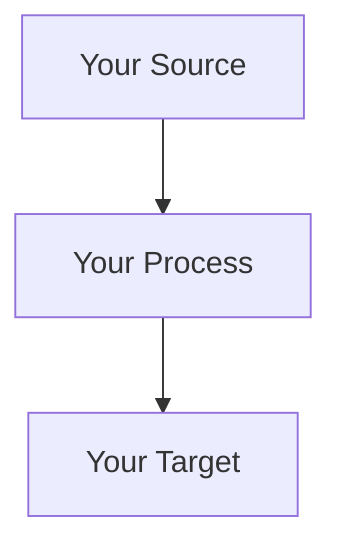
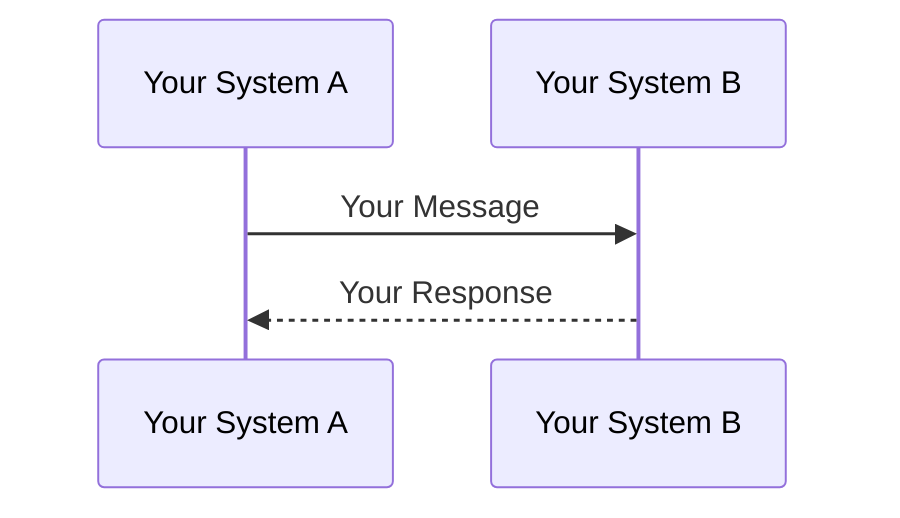
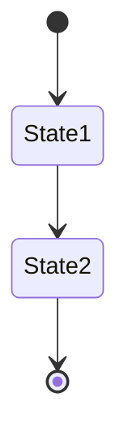
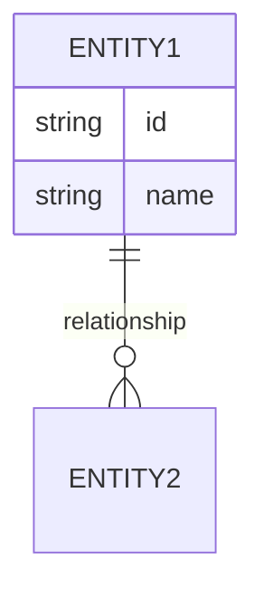
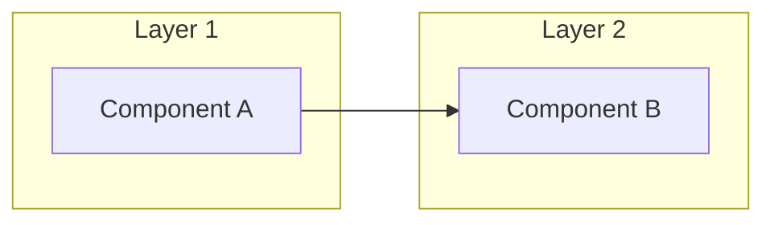
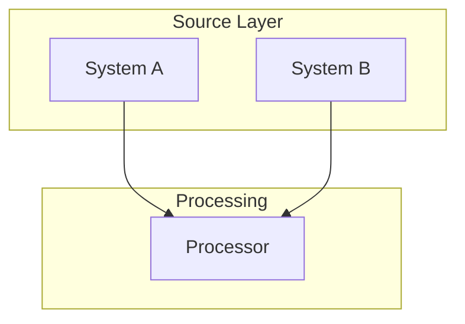
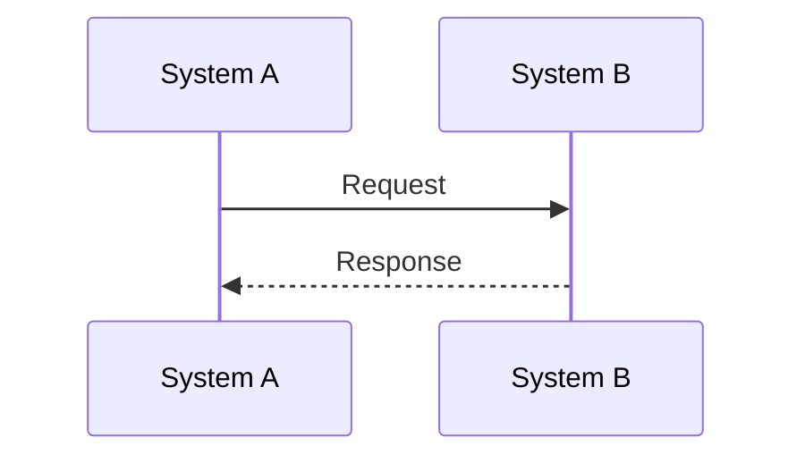
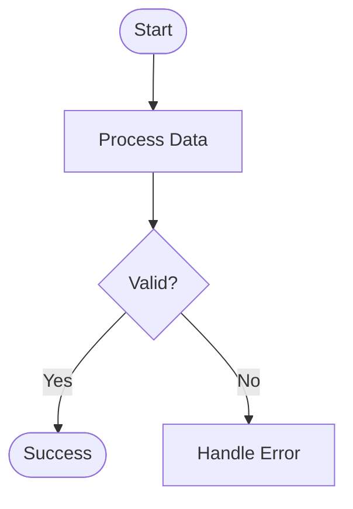
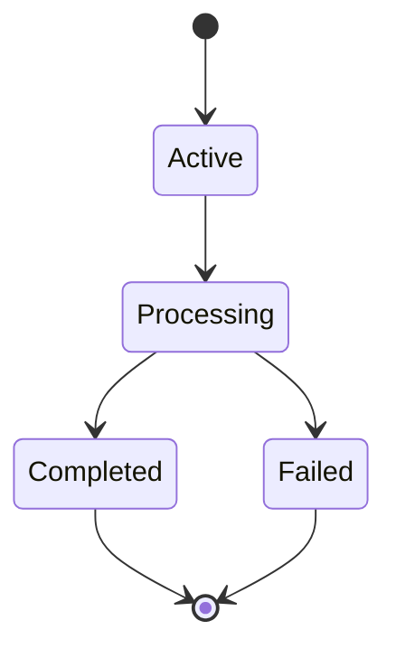
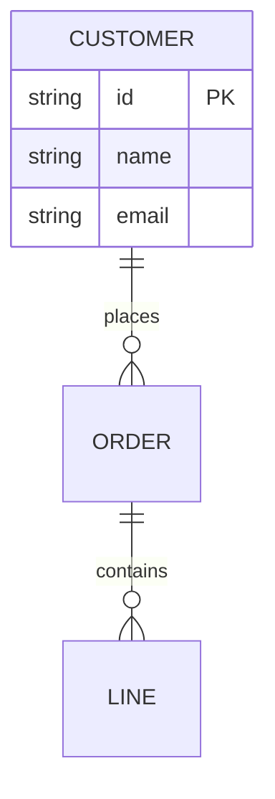

# Design Document: {{project_name}}

<!-- 
MERMAID DIAGRAM GENERATION RULES:
================================

When creating Mermaid diagrams, remember these syntax requirements:

1. Node labels CANNOT contain parentheses - they cause parser errors
2. Instead of parentheses, use: dashes, colons, or just spaces
3. Keep node IDs simple (letters/numbers/underscores only)

Example transformations for clarity:
- Instead of: "System (Production)" use: "System - Production"  
- Instead of: "API (v2)" use: "API v2"
- Instead of: "Process (async)" use: "Process Async"
-->

## Executive Summary
{{executive_summary}}

## Problem Statement
{{problem_statement}}

## Proposed Solution
{{proposed_solution}}

### Integration Approach
{{integration_approach}}

### Key Components
{{key_components}}

## Technical Architecture
{{technical_architecture}}

### System Architecture Diagram
{{system_architecture_diagram_placeholder}}
<!-- REPLACE ABOVE WITH MERMAID like:

-->

### Data Flow Sequence Diagram  
{{data_flow_sequence_diagram_placeholder}}
<!-- REPLACE ABOVE WITH MERMAID like:

-->

### Process Flow Diagram
{{process_flow_diagram_placeholder}}
<!-- REPLACE ABOVE WITH MERMAID like:

-->

### State Transition Diagram
{{state_transition_diagram_placeholder}}
<!-- REPLACE ABOVE WITH MERMAID like:

-->

### Entity Relationship Diagram
{{entity_relationship_diagram_placeholder}}
<!-- REPLACE ABOVE WITH MERMAID like:

-->

### Component Interaction Diagram
{{component_interaction_diagram_placeholder}}
<!-- REPLACE ABOVE WITH MERMAID like:

-->

## Implementation Plan
{{implementation_plan}}

### Phase Breakdown
{{phase_breakdown}}

### Data Mappings
{{data_mappings}}

### Error Handling Strategy
{{error_handling_strategy}}

## Success Metrics
{{success_metrics}}

## Technical Specifications
{{technical_specifications}}

### Database Schema
{{database_schema}}

### API Integrations
{{api_integrations}}

### Transformation Rules
{{transformation_rules}}

## Risks and Mitigations
{{risks_and_mitigations}}

## Timeline
{{timeline}}

---
*Generated from template: design-doc.md*

<!-- 
================================================================================
⚠️ STOP HERE WHEN GENERATING DOCUMENTS ⚠️
================================================================================
EVERYTHING BELOW IS FOR TEMPLATE USERS ONLY - DO NOT INCLUDE IN GENERATED DOCS
================================================================================
-->

# APPENDIX: Mermaid Diagram Reference Guide
*This section is ONLY for debugging Mermaid syntax. DO NOT include in generated documents.*

## Quick Mermaid Syntax Reference

### Critical Rules - NEVER Use These Characters in Labels
- `{ }` → Interpreted as diamond shape syntax
- `( )` → Causes parsing errors  
- `&` → Use "and" instead
- `[ ]` → Reserved for node definition
- `|` → Reserved for separators

### Safe Label Patterns
```
✅ GOOD                          ❌ BAD
A[System Name]                   A[System (Production)]
B[Credit and Inventory]          B[Credit & Inventory]
C[Message Queue - SQS]           C[Message Queue (SQS)]
D[API v2]                        D[API (v2)]
E[DnB Service]                   E[D&B Service]
```

### Basic Diagram Types

#### System Architecture (graph/flowchart)


#### Sequence Diagram


#### Process Flow


#### State Diagram


#### Entity Relationship


### Common Error Patterns and Fixes

#### The "got PS" Error (Most Common!)
This ALWAYS means parentheses in a label:
```
❌ WRONG                           ✅ CORRECT
CREDIT[Credit Check (cache)]      CREDIT[Credit Check - cache]
DB[Staging DB (order_staging_db)] DB[Staging DB - order_staging_db]
API[REST API (v2)]                API[REST API v2]
ENV[Production (US-EAST)]         ENV[Production US-EAST]
SYSTEM API (Aysnc)                SYSTEM API [Async]
```

#### Complete Error Reference
| Error Message | Cause | Example Problem | Fix |
|--------------|-------|-----------------|-----|
| "got PS" | `(` in any label | `A[System (Prod)]` | `A[System Prod]` |
| "got DIAMOND_START" | `{` in label | `A[Data{flow}]` | `A[Dataflow]` |
| "got BLOCK_START" | `{` in entity name | `{ORDER}` in ER diagram | `ORDER` |
| "Expecting TAGEND" | Unclosed bracket | `A[System` | `A[System]` |
| "Expecting SQE" | Space in node ID | `NODE 1[Label]` | `NODE1[Label]` |
| "got ALPHA" | Missing quotes in subgraph | `subgraph My Group` | `subgraph "My Group"` |
| "Syntax error" | Wrong diagram type | Using `graph` syntax in `sequenceDiagram` | Use correct syntax |

#### Node ID vs Label Issues
```
❌ WRONG                    ✅ CORRECT
MY NODE[Label]              MY_NODE[Label]     # Spaces in ID
Node-1[Label]               Node1[Label]       # Dashes in ID  
2Node[Label]                Node2[Label]       # Starting with number
node.service[Label]         node_service[Label] # Dots in ID
```

#### Subgraph Title Issues
```
❌ WRONG                    ✅ CORRECT
subgraph My Layer           subgraph "My Layer"
subgraph Layer(1)           subgraph "Layer 1"
subgraph Layer & Core       subgraph "Layer and Core"
```

### Node Shapes
- `A[Rectangle]` - Default
- `A(Rounded)` - Start/End
- `A{Diamond}` - Decision
- `A[(Database)]` - Storage
- `A((Circle))` - Key point

### Arrow Types
- `-->` Solid arrow
- `-.->` Dotted arrow
- `==>` Thick arrow
- `---` Line no arrow

### Remember
1. Keep labels simple
2. No special characters
3. Test incrementally
4. Use proper diagram type for your use case

---
END OF TEMPLATE REFERENCE - DO NOT INCLUDE IN GENERATED DOCUMENTS